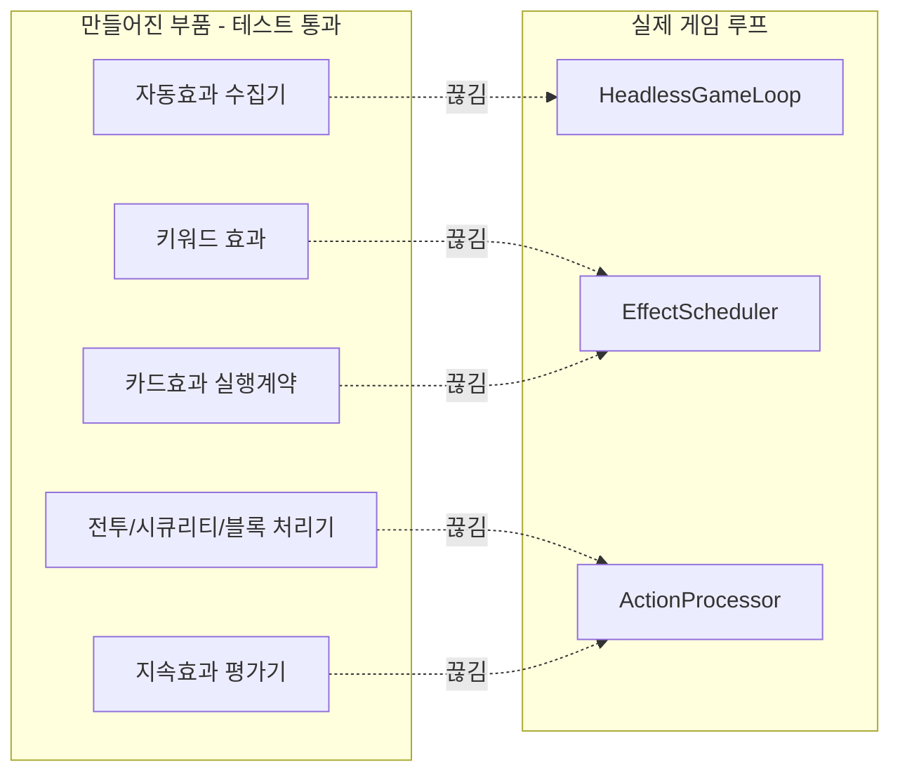
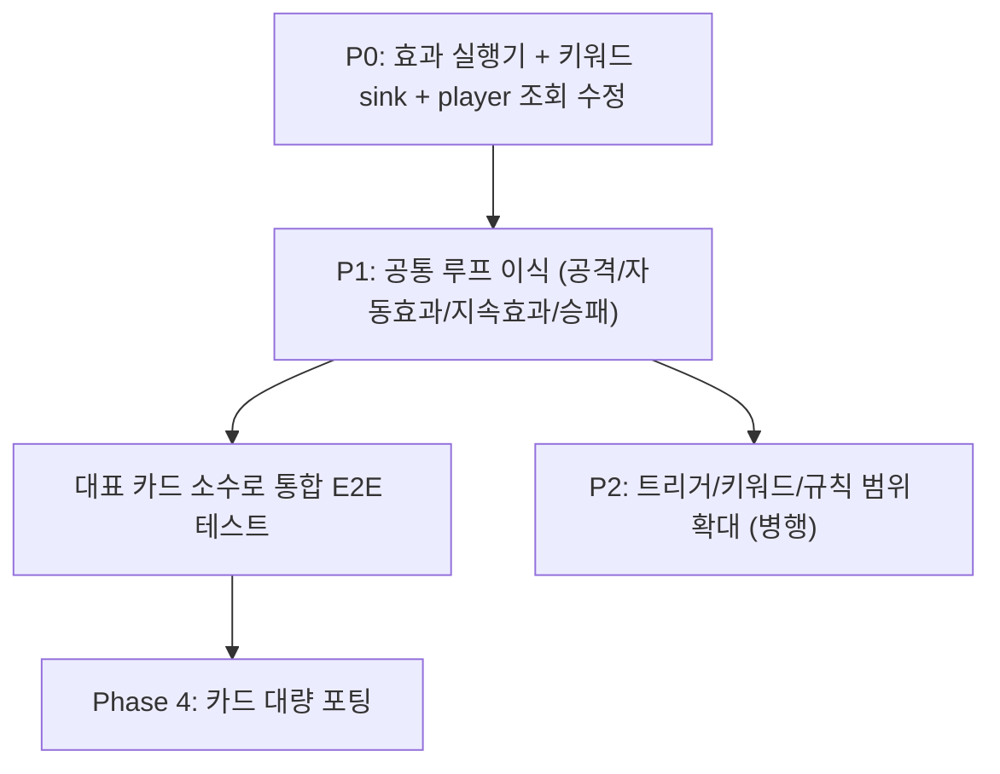

# 감사 요약 (한눈에 보기)

- 작성일: 2026-06-25
- 이 폴더는 Phase 3 완료 이후 "지금 엔진 상태"를 점검한 결과입니다.
- 상세 문서:
  - [Phase 3 parity 감사](phase3_parity_audit_report.md) — goal별 완료/결함 분석
  - [엔진 흐름도 AS-IS vs TO-BE](engine_flow_asis_vs_tobe.md) — 원본 Unity vs 현재 구현 비교

---

## 1. 결론 한 줄

> **Phase 3는 테스트 기준으로 "완료"지만, 만든 helper가 게임 루프에 연결되지 않아 "엔진이 실제로 동작하지는 않는다".**
> Phase 4(카드 포팅) 전에 **연결 작업(통합 수정)** 이 먼저 필요하다.

---

## 2. 지금 상태 (사실 확인)

| 항목 | 상태 |
|------|------|
| Phase 3 단위테스트 | 244개 전부 통과 (재실행 확인) |
| Phase 3 gate | Phase 4 착수 ALLOWED |
| 원본 DCGO 소스 | 확인됨 (`DCGO/Assets/Scripts/Script`) |
| Unity 대체 기반 (Phase 1) | 정상 동작 |
| 게임플레이 연결 | **다수 끊김** (아래 참고) |

"완료"의 의미: **helper와 contract는 만들어졌다.** 하지만 그것을 호출해 게임 상태를 바꾸는 배선이 빠져 있다.

---

## 3. 핵심 문제 (그림 한 장)



> 부품은 다 있는데 **배선(점선)이 안 되어 있다.** 통합 수정 = 점선을 실선으로 바꾸는 일.

---

## 4. 이슈 정리 (심각도순)

### 즉시 고쳐야 함 (P0) — "효과가 아예 상태를 못 바꿈"

| # | 문제 | 쉬운 설명 | 파일 |
|---|------|-----------|------|
| 1 | **효과 실행기가 빈 껍데기** | 카드 효과를 큐에 넣어도 "성공"만 찍고 아무것도 안 함 | `EffectScheduler.cs` (B-03) |
| 2 | **키워드 결과가 버려짐** | Blocker/Rush 등이 "이렇게 바꿔라" 신호를 내지만 받는 곳이 없음 | `KeywordBaseBatch1/2.cs` (B-02) |
| 3 | **카드 조회가 player 1 고정** | 효과 바인딩 조회가 항상 1번 플레이어 기준 → 잘못된 결과 가능 | `CardEffectFactoryBinding.cs:247` (B-01) |

### 통합에 필요 (P1) — "흐름이 Unity와 다름"

| # | 문제 | 쉬운 설명 | 파일 |
|---|------|-----------|------|
| 4 | **공격이 선언만 됨** | 공격 선언 후 블록→전투→시큐리티→종료 단계가 안 이어짐 | `MetadataActionProcessor.cs` (X-01) |
| 5 | **자동효과가 안 돎** | "카드 냈을 때/공격할 때" 트리거를 모으는 코드가 루프에서 호출 안 됨 | `HeadlessGameLoop.cs` (X-05) |
| 6 | **지속효과 반영 안 됨** | "공격 불가" 같은 효과가 가능한 행동 목록에 안 들어감 | `LegalActionDispatcher` (X-04) |
| 7 | **승패 판정 안 붙음** | 승패 조건 계산기가 매치 결과에 연결 안 됨 | `PlayerRuleAdapter` (X-02) |

### 점진적 (P2) — "규칙 범위 부족"

| # | 문제 | 쉬운 설명 |
|---|------|-----------|
| 8 | 트리거 3종만 | 원본은 42종, 지금은 OnPlay/OnDigivolve/WhenAttacking만 (R-01) |
| 9 | 키워드 8개만 | 원본 29개 중 8개 (Evade, Decoy 등 미구현) (R-02) |
| 10 | 삭제 제한 뭉뚱그림 | "전투로 삭제 불가" vs "효과로 삭제 불가" 구분 없음 (R-03) |
| 11 | 기타 세부 규칙 | 대체효과 우선순위, InvertDelta, once-flag reset 등 (R-04~R-15) |

---

## 5. 가장 중요한 인사이트

원본(AS-IS)은 모든 phase가 **하나의 공통 루프**를 돈다.

```
AutoProcessCheck()  ↔  attackProcess.ProcessNextState()  ↔  EndTurnCheck()
   (자동효과)            (공격 한 단계 진행)                (승패/턴종료)
```

→ 효과·공격·승패가 **한 덩어리**로 맞물려 돈다.

현재(TO-BE)는 `action 꺼내기 → 효과 resolve(빈 동작) → terminal 확인`만 한다.

> **즉 위 P1 이슈(4·5·6·7)는 따로따로 고칠 문제가 아니라, "공통 루프"를 TO-BE에 이식하면 한 번에 풀린다.**

---

## 6. 권장 진행 순서



1. **P0 먼저** — 안 하면 카드 포팅해도 효과가 안 나옴
2. **P1 (공통 루프 이식)** — Unity와 같은 흐름 복원
3. **대표 카드로 통합 테스트** — Blocker 덱 + 옵션 1장 + 공격 1턴
4. **그 다음에 Phase 4** 본격 시작

---

## 7. 지금 결정할 것

- [ ] 통합 수정을 **별도 Phase(예: Phase 3.5)** 로 둘지 -> 별도 페이즈로 작업한다 3.5
- [ ] 시작 지점: **P0만** / **P0+P1 묶음** / **공통 루프부터** -> 시작지점은 P0부터 
- [ ] "공통 루프 이식" 설계안을 먼저 만들지 -> 설계안을 최우선적으로 만든다.

원하시면 위 P0 또는 공통 루프 이식을 goal 단위(G3.5-001 ...)로 쪼갠 작업 목록을 만들어 드립니다.
