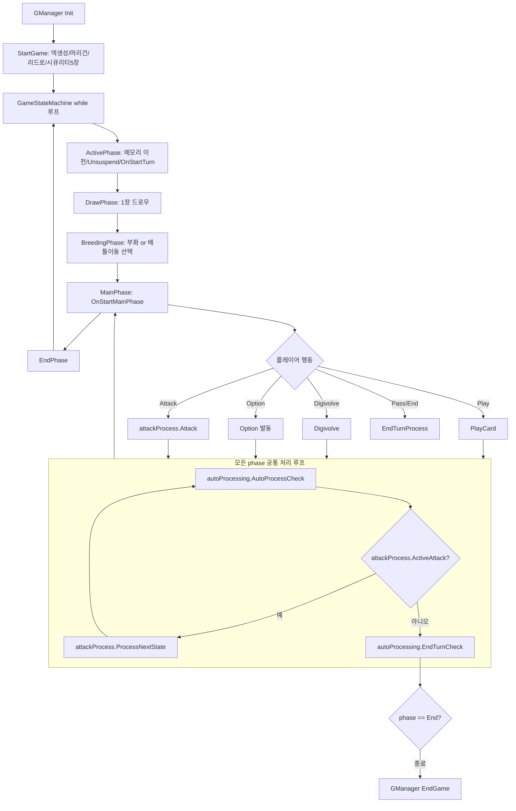
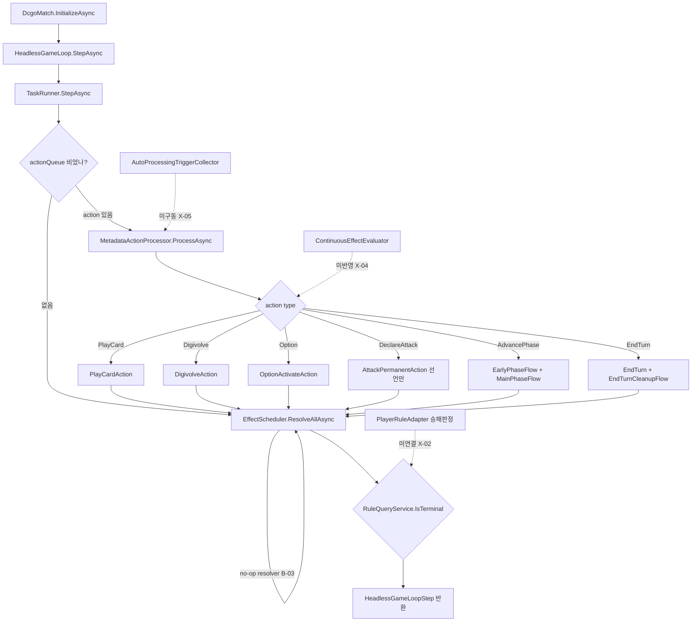
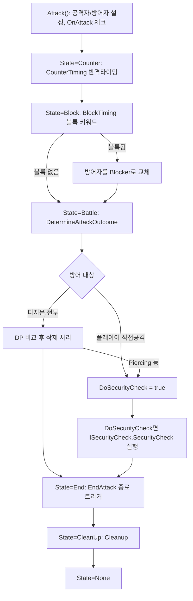
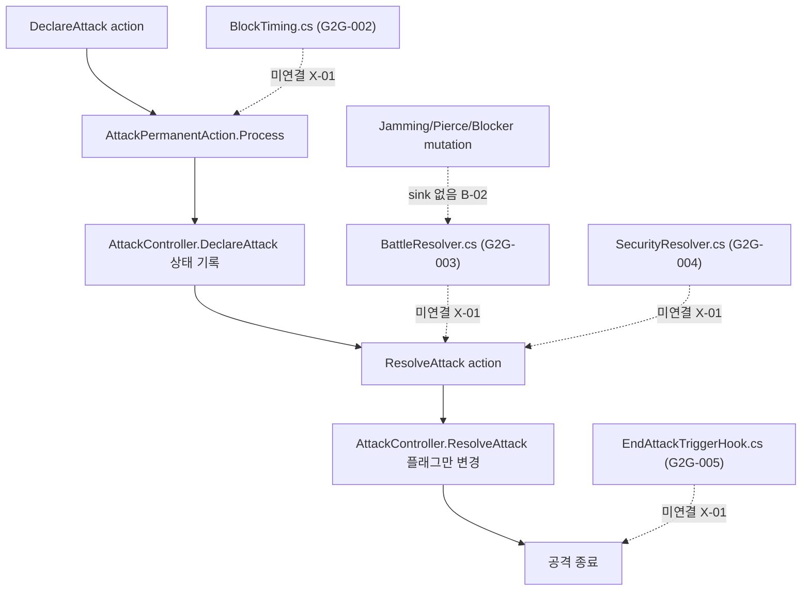
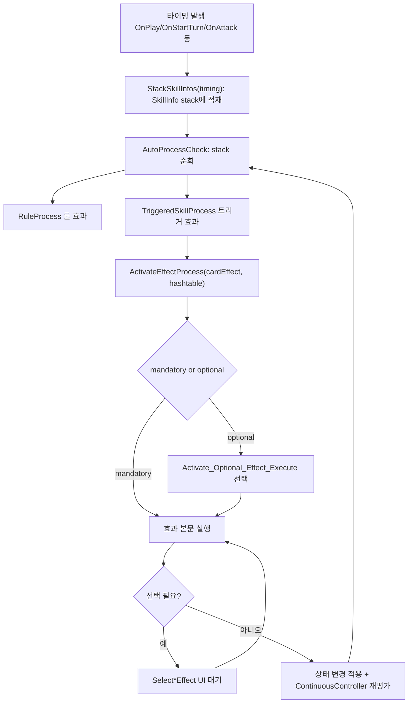
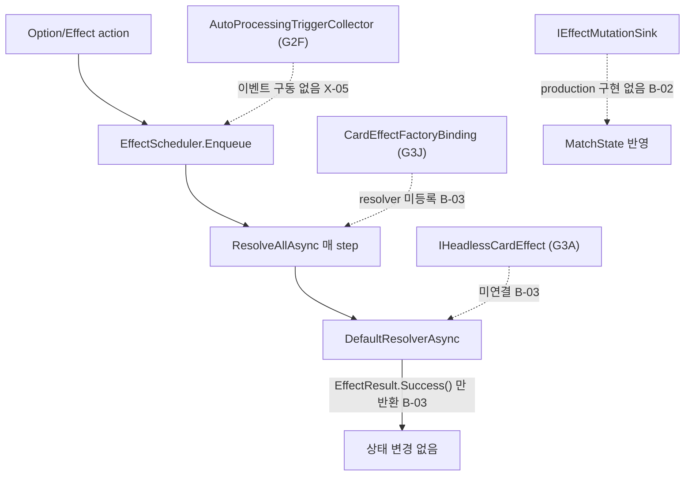
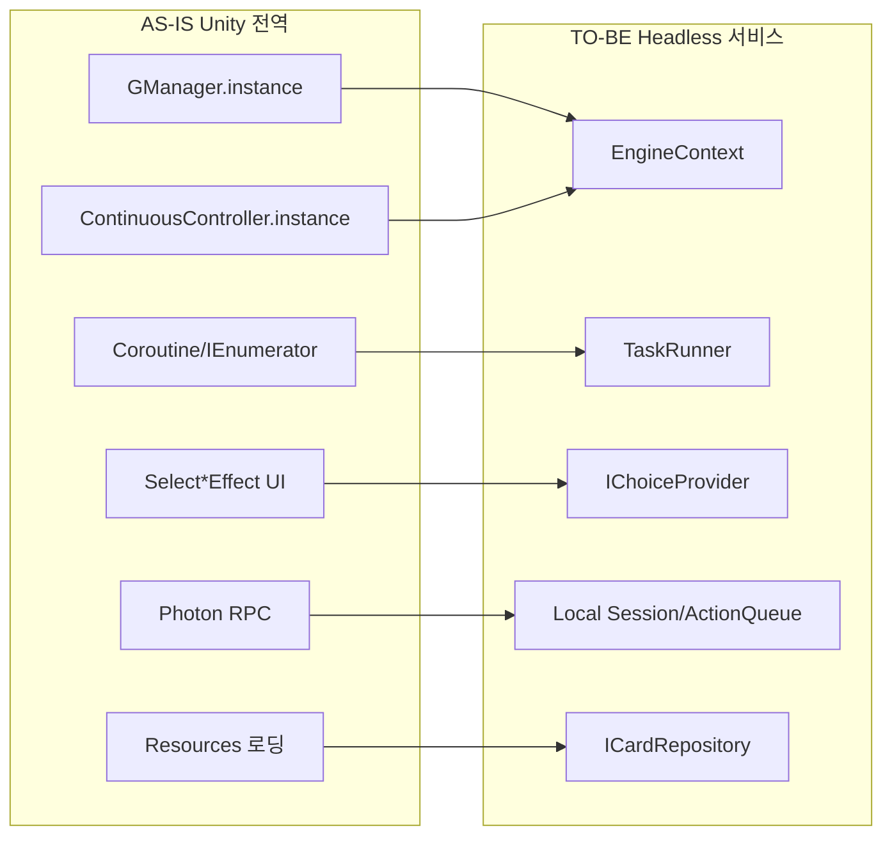
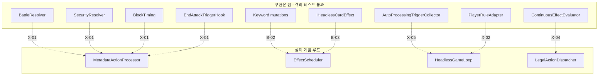

# 엔진 흐름도: AS-IS (Unity 원본) vs TO-BE (현재 Headless)

- 작성일: 2026-06-25
- 목적: 통합 수정 Phase 착수 전, 원본 Unity DCGO 게임 흐름(AS-IS)과 현재 Headless 구현 흐름(TO-BE)을 나란히 비교해 어디가 끊겼는지 시각적으로 확인
- AS-IS 근거: **원본 코드 직접 확인** — `DCGO/Assets/Scripts/Script/{TurnStateMachine,AttackProcess,AutoProcessing,GameContext}.cs`
- TO-BE 근거: `src/HeadlessDCGO.Engine/Headless/Runtime/`, `Headless/Effects/` 실제 코드
- 검증 상태: AS-IS 흐름도는 2026-06-25 원본 소스로 재검증 완료 (8절 검증 노트 참고)

> 범례
> - 실선 화살표 = 실제 연결됨
> - 점선 화살표 = 끊김 / 미연동 (이슈 ID 표기)
> - `[BUG]` `[X-..]` `[R-..]` = `phase3_parity_audit_report.md`의 이슈 ID

---

## 0. 한눈에 보는 차이 요약

| 영역 | AS-IS (Unity) | TO-BE (Headless) | 상태 |
|------|---------------|------------------|------|
| 실행 단위 | `MonoBehaviour` + Coroutine + frame | `DcgoMatch` / `HeadlessGameLoop` step | 대체됨 |
| 전역 접근 | `GManager.instance`, `ContinuousController.instance` | `EngineContext` + service | 대체됨 |
| 턴 진행 | `TurnStateMachine` 5 phase 루프 | `TurnController` + `*PhaseFlow`, phase 9종(superset) | 부분 (R-A) |
| 메인 액션 | `MainPhaseAction` 계열 | `PlayCard/Digivolve/Option/Attack Action` | 부분 |
| 공격 처리 | `AttackProcess` 단일 파이프라인 | declare만 연결, battle/security/block 분리 | **끊김 (X-01)** |
| 자동 효과 | `AutoProcessing` coroutine | collector contract 존재, 루프 미구동 | **끊김 (X-05)** |
| 효과 실행 | `Effects` / `ICardEffect` coroutine | `EffectScheduler` no-op resolver | **끊김 (B-03)** |
| 키워드 적용 | `AttackProcess`/`Permanent`에 직접 반영 | mutation 발행만, sink 없음 | **끊김 (B-02)** |
| 지속 효과 | `ContinuousController` 상시 재평가 | `ContinuousEffectEvaluator` 미반영 | **끊김 (X-04)** |
| 승패 판정 | `GManager` EndGame | `PlayerRuleAdapter` 미연결 | **끊김 (X-02)** |

---

## 1. 전체 게임 루프

### 1.1 AS-IS — Unity 원본 (`TurnStateMachine.GameStateMachine`)

실제 코드: `StartGame()` 후 `while` 루프에서 `ActivePhase → DrawPhase → BreedingPhase → MainPhase → EndPhase`를 순환한다. `GameContext.phase` enum은 **Active, Draw, Breeding, Main, End** 5개뿐이며, unsuspend는 별도 phase가 아니라 **Active Phase 안에서 처리**된다.

핵심: AS-IS의 심장은 **`AutoProcessCheck()` ↔ `attackProcess.ProcessNextState()` ↔ `EndTurnCheck()`가 교차로 반복되는 루프**다. 모든 phase가 이 루프를 호출하며, 효과 처리와 공격 state 진행과 승패 확인이 한 덩어리로 맞물려 돈다. `ContinuousController`는 이 과정에서 상시 효과를 계속 재평가한다.

### 1.2 TO-BE — 현재 Headless

핵심: TO-BE는 **action을 큐에서 꺼내 처리 → effect를 resolve(no-op) → terminal 확인** 의 단순 step 루프다. AS-IS의 `AutoProcessing` / `ContinuousController` 상시 재평가 고리가 **루프에 연결되어 있지 않다**.

---

## 2. 공격 파이프라인 (가장 큰 차이)

### 2.1 AS-IS — `AttackProcess` state machine

실제 코드: `AttackProcess.AttackState` enum = **None → Counter → Block → Battle → End → CleanUp → None**. `Attack()` 코루틴이 공격을 시작하면 State가 설정되고, 상위 `ProcessNextState()`가 state별 코루틴을 호출한다. **시큐리티 체크는 별도 state가 아니라 `Battle`(`DetermineAttackOutcome`) 안에 통합**되어 있다 (`AttackProcess.cs` line 458-465 `DoSecurityCheck`).

AS-IS는 선언부터 종료까지 **하나의 state machine으로 연결된 파이프라인**이며, `ProcessNextState()`가 매번 한 state씩 진행시킨다. Counter(반격)·Block·시큐리티 체크가 모두 이 흐름 안의 분기다.

### 2.2 TO-BE — 컴포넌트는 있으나 분리됨

TO-BE는 `BlockTiming`, `BattleResolver`, `SecurityResolver`, `EndAttackTriggerHook`이 **각각 단위테스트는 통과**하지만, `MetadataActionProcessor`의 공격 처리는 `DeclareAttack` → `ResolveAttack(플래그 변경)`만 한다. **전투/시큐리티/블록/종료트리거가 파이프라인에 연결되지 않음.**

---

## 3. 효과 처리 흐름

### 3.1 AS-IS — `AutoProcessing` + `Effects` coroutine

실제 코드: 타이밍 발생 시 `StackSkillInfos(hashtable, timing)`로 해당 타이밍 스킬을 stack에 쌓고, `AutoProcessCheck()`가 stack을 비우며 처리한다. 각 효과는 `ActivateEffectProcess(cardEffect, hashtable)`로 실행되며 mandatory/optional 분기와 cut-in을 처리한다 (`AutoProcessing.cs` line 122 `AutoProcessCheck`, 984 `StackSkillInfos`, 1063 `ActivateEffectProcess`).

### 3.2 TO-BE — 큐는 있으나 실행이 비어 있음

TO-BE는 효과를 큐에 넣고 매 step `ResolveAllAsync`를 부르지만, 기본 resolver가 **빈 성공만 반환**한다. 카드 효과 본문(`IHeadlessCardEffect`)과 factory binding이 resolver로 등록되어 있지 않고, mutation을 상태에 반영할 production sink도 없다.

---

## 4. 의존성 / 컨텍스트 대체 (이 부분은 정상 동작)

이 계층(Phase 1 Unity 대체 기반)은 **정상적으로 대체 완료**되었다. 끊긴 부분은 이 위에 올라가는 게임플레이 연결(2, 3절)이다.

---

## 5. 끊긴 연결 종합도 (통합 수정 Phase 대상)

이 점선들이 전부 실선이 되면 "엔진이 Unity처럼 동작"하는 상태가 된다. 통합 수정 Phase의 목표는 **이 점선을 실선으로 바꾸는 것**이다.

---

## 6. 어디부터 손댈지 (흐름도 기준 우선순위)

| 순위 | 끊긴 연결 | 흐름도 위치 | 이슈 |
|------|-----------|-------------|------|
| P0 | EffectScheduler ← IHeadlessCardEffect/Factory | 3.2 | B-03 |
| P0 | EffectScheduler ← Mutation sink | 3.2 | B-02 |
| P0 | Factory Lookup player 하드코딩 제거 | (4절 binding) | B-01 |
| P1 | MetadataActionProcessor ← Battle/Security/Block/EndAttack | 2.2 | X-01 |
| P1 | HeadlessGameLoop ← AutoProcessing collect | 3.2 | X-05 |
| P1 | LegalActionDispatcher ← ContinuousEffectEvaluator | 1.2 | X-04 |
| P1 | HeadlessGameLoop ← PlayerRuleAdapter terminal | 1.2 | X-02 |
| P2 | trigger/keyword/restriction coverage | 전반 | R-01~R-15 |

---

## 7. Phase 모델 비교 (AS-IS vs TO-BE)

| | AS-IS `GameContext.phase` | TO-BE `HeadlessPhase` |
|--|---------------------------|------------------------|
| 값 | Active, Draw, Breeding, Main, End (5) | None, Active, Draw, Breeding, Main, End, Setup, Unsuspend, MemoryPass (9) |
| Unsuspend | Active Phase 내부 처리 | 별도 `Unsuspend` phase로 분리 |
| Setup | `StartGame()` 코루틴 (phase 아님) | 별도 `Setup` phase |
| 메모리 패스 | Main phase 내 처리 | 별도 `MemoryPass` phase |

TO-BE는 AS-IS 5 phase를 **포함하는 superset**이다. unsuspend/setup/memory-pass를 독립 phase로 끌어낸 것은 headless step 제어를 위한 설계 차이로, 게임 의미만 보존되면 문제는 아니다. 다만 **AS-IS의 "Active phase 안에서 unsuspend"** 의미와 매핑이 맞는지 통합 시 확인이 필요하다 (R-A, audit G2A-001 risk와 동일).

---

## 8. AS-IS 검증 노트 (원본 코드 인용)

| 흐름도 항목 | 원본 파일 | 핵심 근거 |
|-------------|-----------|-----------|
| Phase 루프 | `TurnStateMachine.cs` | `GameStateMachine()` line 301: `StartGame → ActivePhase → DrawPhase → BreedingPhase → MainPhase → EndPhase` while 루프 |
| 공통 처리 루프 | `TurnStateMachine.cs` | 각 phase에서 `autoProcessing.AutoProcessCheck()` ↔ `attackProcess.ProcessNextState()` ↔ `autoProcessing.EndTurnCheck()` 반복 (line 564-579, 685-696, 905-950 등) |
| Active 내 Unsuspend | `TurnStateMachine.cs` line 622 | `new IUnsuspendPermanents(...).Unsuspend()`가 Active Phase region 안에 있음 |
| 공격 state machine | `AttackProcess.cs` line 25-62 | `AttackState{None,Counter,Block,Battle,End,CleanUp}` + `ProcessNextState()` switch |
| 시큐리티 = Battle 내부 | `AttackProcess.cs` line 458-465 | `DetermineAttackOutcome` 안에서 `DoSecurityCheck`면 `ISecurityCheck.SecurityCheck()` 실행 |
| 효과 수집/실행 | `AutoProcessing.cs` | line 122 `AutoProcessCheck`, 984 `StackSkillInfos`, 1063 `ActivateEffectProcess`(mandatory/optional) |
| phase enum | `GameContext.cs` line 116-122 | `enum phase { Active, Draw, Breeding, Main, End }` |

처음 그렸던 추측 흐름도와의 차이 (수정 반영됨):
- Unsuspend는 별도 phase가 아니라 **Active Phase 내부** 처리
- 공격은 declare-suspend-block-... 선형이 아니라 **Counter → Block → Battle → End → CleanUp state machine**
- 시큐리티 체크는 별도 단계가 아니라 **Battle state 내부**
- 효과는 단순 큐가 아니라 **StackSkillInfos(timing) → AutoProcessCheck stack 순회** 방식

---

## 9. 확인 후 결정할 사항

이 문서를 확인한 뒤 다음 중 하나를 결정하면 됩니다.

1. **흐름도가 실제 인식과 맞는가** — AS-IS는 원본 코드로 재검증 완료. 추가로 정밀하게 보고 싶은 영역이 있는지
2. **통합 수정 Phase 범위** — P0만 먼저 / P0+P1 묶어서 / 공격 파이프라인(X-01)부터
3. **goal 분할 방식** — 끊긴 연결 1개 = goal 1개로 쪼갤지 여부
4. **AS-IS의 "AutoProcessCheck ↔ ProcessNextState ↔ EndTurnCheck 공통 루프"** 를 TO-BE `HeadlessGameLoop`에 어떻게 재현할지 — 이것이 X-01/X-04/X-05를 한 번에 푸는 핵심 구조
