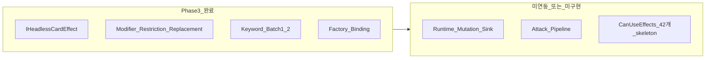
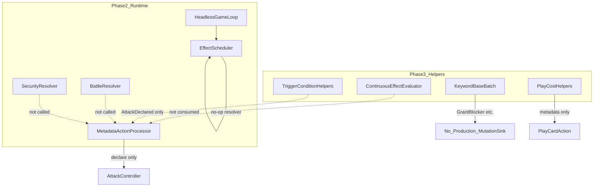

# Phase 3 진행상태 및 Unity Parity 감사 보고서

- 감사 일시: 2026-06-25
- 감사 범위: Phase 3 전체 (G3A-001 ~ G3L-002, G3Z-001 aggregate)
- 선행 의존: Phase 2 (G2Z-001 gate) 교차 검증 포함
- 비교 기준: Goal spec, 테스트 결과 문서, `Headless/Effects/` 구현, `Assets/Scripts/Script/` 포팅 트리
- 제한: 원본 `DCGO/Assets/...`는 **이 저장소에 없음**. 라인 단위 Unity behavioral parity는 goal spec의 AS-IS 목록과 각 goal `미해결 리스크`를 1차 근거로 사용함.

---

## 1. Executive Summary

### 공식 완료 상태

| 항목 | 문서 기록 | 감사 재실행 (2026-06-25) |
|------|-----------|--------------------------|
| Phase 3 gate goals | 23/23 COMPLETE | 23/23 test projects PASS |
| G3Z-001 aggregate | COMPLETE (9/9) | 9/9 PASS |
| Gate unit tests | 235/235 PASS | 244 tests across 24 projects, 0 failures |
| Phase 4 착수 gate | ALLOWED | 문서와 일치 |

**결론:** Phase 3는 문서·단위테스트 기준으로 **정상 완료**다.

### 실질 게임플레이 준비도

Phase 3 "COMPLETE"의 의미는 **공통 helper/contract 계층 구현**이지, Unity AS-IS와 동등한 end-to-end 게임플레이가 아니다.

| 계층 | 상태 |
|------|------|
| `Headless/Effects/` helper·contract | 구현됨 (36개 파일) |
| `Assets/...` 포팅 트리 | 대부분 skeleton; Phase 3 대상 8개 commons wrapper + 9개 factory keyword wrapper만 실질 연결 |
| Phase 2 런타임 연동 | 공격 declare, effect enqueue 등 부분 연결; battle/security/auto-processing 통합 미완 |
| Keyword mutation 적용 | 계약만 존재; production `IEffectMutationSink` 없음 |
| Effect resolution | `EffectScheduler` 기본 resolver가 no-op |

**핵심 메시지:** 단위테스트는 helper 격리 계약을 검증한다. 통합 루프에서 Phase 3 helper 출력이 소비되지 않으면 게임플레이는 Unity와 크게 다르다.

---

## 2. Goal Completion Matrix

각 goal에 대해 Tests / Scope / Assets parity / Verdict를 기록한다.

| Goal | Area | Tests | Scope | Assets | Verdict | 핵심 이슈 |
|------|------|-------|-------|--------|---------|-----------|
| G3A-001 | Effect contract | 10/10 PASS | contract | N/A | OK | mutation boundary 계약 고정; production sink 미구현 (B-02) |
| G3A-002 | SkillInfo | 11/11 PASS | contract | skeleton (`Assets/.../SkillInfo.cs`) | OK | Hashtable 변환은 G3B에 위임 |
| G3B-001 | EffectContext adapter | 9/9 PASS | contract | skeleton (`GetFromHashtable.cs`, `HashtableSetting.cs`) | GAP | 대표 legacy key만 매핑 (R-15) |
| G3C-001 | Trigger conditions | 10/10 PASS | contract | 42개 `CanUseEffects/` skeleton | GAP | 3종 trigger만 구현 (R-01, R-08, R-09) |
| G3C-002 | CanUseEffects helper | 10/10 PASS | contract | skeleton | GAP | generic 조합만; 개별 When* 미포팅 (INTENTIONAL→Phase 4) |
| G3D-001 | MinMax DP/cost/level | 10/10 PASS | contract | skeleton (`MinMax_DP_Cost_Level/`) | OK | |
| G3D-002 | Name/color/trait | 10/10 PASS | contract | skeleton | OK | convenience helper 확장은 Phase 4 |
| G3E-001 | Play cost | 10/10 PASS | contract + partial runtime | skeleton (`ChangePlayCost`, `ShowReducedCost`) | GAP | helper는 `PlayCardAction`에 연결; continuous modifier 미반영 (X-03) |
| G3E-002 | Digivolution cost | 11/11 PASS | contract + partial runtime | skeleton | GAP | `DigivolveAction`에 helper 연결; effect-driven reduction 미반영 |
| G3F-001 | Target filtering | 10/10 PASS | contract | skeleton | OK | |
| G3F-002 | Zone query | 10/10 PASS | contract | skeleton | OK | LinkedCards/Custom/Execution 범위 밖 |
| G3G-001 | Keyword batch 1 | 10/10 PASS | contract | factory wrapper; **commons skeleton** | GAP | mutation 미연동 (B-02); split-brain (R-11) |
| G3G-002 | Keyword batch 2 | 10/10 PASS | contract | factory wrapper; **commons skeleton** | GAP | Blitz 하드코딩 (R-10); mutation 미연동 |
| G3H-001 | Modifiers | 11/11 PASS | contract | thin wrapper (`ModifierHelperFactory`) | GAP | InvertDelta가 FinalValue 미반영 (R-07) |
| G3H-002 | Restrictions | 11/11 PASS | contract | thin wrapper (`RestrictionHelperFactory`) | GAP | Delete kind 통합 (R-03); CannotUnsuspend 없음 (R-04) |
| G3I-001 | Replacement | 12/12 PASS | contract | thin wrapper | GAP | first-match (R-05); Redirect 실행 defer (INTENTIONAL) |
| G3I-002 | Continuous evaluator | 10/10 PASS | contract | thin wrapper | GAP | 런타임 미연동 (X-04) |
| G3J-001 | CardEffectFactory binding | 10/10 PASS | contract | thin wrapper | **BUG** | Lookup player 1 하드코딩 (B-01) |
| G3J-002 | PermanentEffectFactory | 10/10 PASS | contract | thin wrapper | OK | |
| G3K-001 | Effect selection | 10/10 PASS | contract | thin wrapper | OK | 개별 카드 연결은 Phase 4 |
| G3K-002 | Timing priority | 10/10 PASS | contract | thin wrapper | OK | |
| G3L-001 | Once-per-turn flags | 10/10 PASS | contract | thin wrapper | GAP | turn reset 미연결 (R-13) |
| G3L-002 | Inherited/granted/security | 10/10 PASS | contract | thin wrapper | GAP | digivolution stack enumeration 미구현 (R-14) |
| G3Z-001 | Aggregate gate | 9/9 PASS | docs only | N/A | OK | |

**Verdict 요약:** OK 11 / GAP 11 / BUG 1 / DEFER 0 (G3Z docs-only)

---

## 3. Headless vs Assets Parity (14+ file pairs)

Phase 3 canonical 로직은 `src/HeadlessDCGO.Engine/Headless/Effects/`에 있다. `Assets/...`는 skeleton, thin factory wrapper, 또는 Headless 위임만 수행한다.

### 3.1 Thin wrapper (Headless ↔ Assets parity OK)

| # | Headless | Assets | 관계 |
|---|----------|--------|------|
| 1 | `ModifierHelpers.cs` | `CardEffectCommons/ModifierHelpers.cs` | `ModifierHelperFactory`가 `NumericModifier` 생성만 위임 |
| 2 | `RestrictionHelpers.cs` | `CardEffectCommons/RestrictionHelpers.cs` | `RestrictionHelperFactory` |
| 3 | `ReplacementHelpers.cs` | `CardEffectCommons/ReplacementHelpers.cs` | `ReplacementHelperFactory` |
| 4 | `ContinuousEffectEvaluator.cs` | `CardEffectCommons/ContinuousEffectEvaluator.cs` | factory delegate |
| 5 | `EffectChoiceHelpers.cs` | `CardEffectCommons/EffectChoiceHelpers.cs` | factory delegate |
| 6 | `OnceFlagHelpers.cs` | `CardEffectCommons/OnceFlagHelpers.cs` | factory delegate |
| 7 | `TimingPriorityHelpers.cs` | `CardEffectCommons/TimingPriorityHelpers.cs` | factory delegate |
| 8 | `InheritedGrantedSecurityHelpers.cs` | `CardEffectCommons/InheritedGrantedSecurityHelpers.cs` | factory delegate |

### 3.2 Factory wrapper only (Commons split-brain)

| # | Headless | Assets Factory | Assets Commons | 이슈 |
|---|----------|----------------|----------------|------|
| 9 | `KeywordBaseBatch1.cs` | `CardEffectFactory/KeyWordEffects/Blocker.cs` 등 4개 | `CardEffectCommons/KeyWordEffects/Blocker.cs` 등 **29개 skeleton** | R-11 |
| 10 | `KeywordBaseBatch2.cs` | `CardEffectFactory/KeyWordEffects/Rush.cs` 등 4개 | Commons 29개 중 해당 4개도 skeleton | R-11 |
| 11 | `CardEffectFactoryBinding.cs` | `CardEffectFactory/CardEffectFactoryBinding.cs` | N/A | B-01 |

### 3.3 Headless only (Assets 전부 skeleton)

| # | Headless | Assets 대응 | 커버리지 |
|---|----------|-------------|----------|
| 12 | `TriggerConditionHelpers.cs` | `CardEffectCommons/CanUseEffects/` **42 files skeleton** | 3/42+ trigger kinds (R-01) |
| 13 | `CanUseEffectHelpers.cs` | 동일 디렉터리 | generic API만 |
| 14 | `EffectContextAdapter.cs` | `GetFromHashtable.cs`, `HashtableSetting.cs` skeleton | 대표 key만 (R-15) |
| 15 | `PlayCostHelpers.cs` | `ChangePlayCost.cs`, `ShowReducedCost.cs` skeleton | runtime partial wire |
| 16 | `DigivolutionCostHelpers.cs` | `GiveEffect/.../ChangeDigivolutionCost.cs` skeleton | runtime partial wire |
| 17 | `TargetFilterHelpers.cs` | (commons 내 분산 skeleton) | helper only |
| 18 | `ZoneQueryHelpers.cs` | (commons 내 분산 skeleton) | helper only |
| 19 | `MinMaxRequirementHelpers.cs` | `MinMax_DP_Cost_Level/` skeleton | helper only |
| 20 | `CardRequirementHelpers.cs` | (commons 내 분산 skeleton) | helper only |
| 21 | `SkillInfo.cs` | `Assets/.../SkillInfo.cs` skeleton | Headless only |
| 22 | `HeadlessCardEffectContract.cs` | `ICardEffect.cs` skeleton | Headless only |

### 3.4 Assets coverage scorecard

| AS-IS surface | Headless Phase 3 | Assets in repo |
|---------------|------------------|----------------|
| `CanUseEffects/` | 3 trigger + generic CanUse | 42/42 skeleton |
| `KeyWordEffects/` (Commons) | 8 keywords | 29/29 skeleton |
| `CardEffectFactory/KeyWordEffects/` | 8 keywords | 8 wrapper + 21 skeleton |
| `CardEffectFactory/` (non-keyword) | binding only | 40+ skeleton |
| `CardEffects/` classes | 0 | 60+ skeleton |

### 3.5 Unity dependency bypass

`Assets/...` effect 파일에 `UnityEngine`/`Photon` 참조는 없다. 문제는 Unity API 우회가 아니라 **원본 로직이 Headless helper subset으로 재구현**되었고, `AutoProcessing`/`AttackProcess`/`TurnStateMachine` 통합 로직은 `Headless/Runtime/`에 부분적으로만 존재한다는 점이다.

---

## 4. Phase 2 Runtime Cross-Audit

Phase 3 helper가 Phase 2 런타임에서 소비되는지 검증했다.

### 4.1 Attack pipeline (X-01)

| Component | File | Unit tested | Wired in `MetadataActionProcessor` |
|-----------|------|-------------|-----------------------------------|
| Attack declare | `AttackPermanentAction.cs` | G2E-004 | Yes (`NormalizedDeclareAttack`) |
| Block timing | `BlockTiming.cs` | G2G-002 | **No** |
| Battle DP deletion | `BattleResolver.cs` | G2G-003 | **No** |
| Security check | `SecurityResolver.cs` | G2G-004 | **No** |
| End attack trigger | `EndAttackTriggerHook.cs` | G2G-005 | **No** |

`MetadataActionProcessor.ResolveAttack`은 `context.AttackController.ResolveAttack(reason)`만 호출한다. block → battle → security → end-attack 체인이 없다.

`Assets/Scripts/Script/AttackProcess.cs`, `TurnStateMachine.cs`, `AutoProcessing.cs`는 전부 `TODO: Skeleton only`.

### 4.2 Effect resolution (B-03)

`EffectScheduler.DefaultResolverAsync`는 `EffectResult.Success()`만 반환한다.

`HeadlessGameLoop.StepAsync`가 매 step마다 `ResolveAllAsync`를 호출하므로, enqueue된 효과는 **성공으로 처리되지만 게임 상태는 변하지 않는다**.

`IHeadlessCardEffect` resolver가 기본 `EngineContext`에 등록되어 있지 않다.

### 4.3 Keyword mutations (B-02)

Keyword `ResolveAsync` → `EffectMutation("GrantBlocker", ...)` → `IEffectMutationSink.Apply`.

production 구현은 없고 `RecordingEffectMutationSink`(테스트 전용)만 존재한다.

### 4.4 Cost helpers vs continuous effects (X-03, 부분 완화)

- `PlayCardAction` / `OptionActivateAction` → `PlayCostHelpers.TryResolveCost` 사용 (G3E-001 범위 내 연결됨)
- `DigivolveAction` → `DigivolutionCostHelpers.TryResolveCost` 사용 (G3E-002 범위 내 연결됨)
- **갭:** `PlayCostHelpers.ReadModifiers`는 card/instance **metadata**만 읽는다. `ContinuousEffectEvaluator`나 다른 카드의 상시 비용 변경 효과는 play/digivolve 경로에 주입되지 않는다.

### 4.5 Continuous evaluator (X-04)

`ContinuousEffectEvaluator`는 modifier/restriction/replacement를 조합해 평가하지만:

- `HeadlessLegalActionDispatcher`, `AttackPermanentAction`, `BlockTiming`이 이 출력을 사용하지 않는다
- attack/security legality는 static metadata 기반

### 4.6 Auto-processing (X-05)

`AutoProcessingTriggerCollector`, `SecurityDelayedTriggerHook`, `EndAttackTriggerHook`은 contract + test로 존재하나 `HeadlessGameLoop` / `MetadataActionProcessor`에서 event-driven collect를 구동하지 않는다.

### 4.7 Terminal checks (X-02)

`PlayerRuleAdapter`는 terminal 조건을 평가하지만 `DcgoMatch` / `InMemoryRuleQueryService.SetTerminal()`과 연결되지 않는다.

### 4.8 Once-flag lifecycle (R-13)

`OnceFlagHelpers`는 구현됐으나 `HeadlessEndTurnCleanupFlow`에서 turn reset을 호출하지 않는다 (grep: `OnceFlag` 참조 없음).

### 4.9 Architecture gap diagram

---

## 5. Issue Register

### 5.1 BUG — Phase 3 계약 내 수정 필요

| ID | 항목 | 파일 | 영향 | 권장 조치 | Phase |
|----|------|------|------|-----------|-------|
| B-01 | `Lookup(card, trigger)` player 1 하드코딩 | `CardEffectFactoryBinding.cs:247-248` | player-specific binding lookup 오류 | `Lookup`에 `HeadlessPlayerId`/`EffectContext` 파라미터 추가; 테스트 보강 | 3/4 |
| B-02 | Keyword mutation sink 미연동 | `HeadlessCardEffectContract.cs`, `KeywordBaseBatch1/2.cs` | Blocker/Rush/Blitz 등이 게임 상태에 반영 안 됨 | production `IEffectMutationSink` 구현 + `MatchState` 반영 | 4 |
| B-03 | `EffectScheduler` no-op resolver | `EffectScheduler.cs:125-132` | enqueue 효과가 빈 성공만 반환 | `IHeadlessCardEffect` resolver 등록; factory binding 연동 | 4 |

### 5.2 RISK — Unity와 다르거나 coverage 부족

| ID | 항목 | Headless | Unity AS-IS 차이 | Phase |
|----|------|----------|------------------|-------|
| R-01 | Trigger coverage | 3 kinds | `CanUseEffects/` 42+ skeleton | 4 |
| R-02 | Keyword coverage | 8/29 | 21+ keywords skeleton | 4 |
| R-03 | Delete restriction | 단일 `Delete` kind | battle/effect별 세분화 (`CanNotBeDeletedByBattle` 등) | 4 |
| R-04 | CannotUnsuspend | 미구현 | AS-IS `CanNotUnsuspend` 존재 | 4 |
| R-05 | Replacement strategy | first-match | Evade/Decoy/Scapegoat 미포팅; stacking 불명 | 4 |
| R-06 | Restriction strategy | all matching accumulate | Replacement와 비대칭 | 4 |
| R-07 | InvertDelta modifier | `invertDelta` 별도 노출, `FinalValue` 미반영 | `InvertSAttackClass` 타이밍 검증 필요 | 4 |
| R-08 | WhenAttacking | latest `AttackDeclared` only | per-attack Hashtable context | 4 |
| R-09 | IsOnPlay evolution | `SourceIds.Count > 0` → not OnPlay | inherited source on play false-negative | 4 |
| R-10 | Blitz conditions | `opponentMemory >= 1`, `OnPlay` default | variant별 조건 다를 수 있음 | 4 |
| R-11 | Commons/Factory split-brain | Factory→Headless; Commons skeleton | goal 문서는 Factory 교체만 기록 | 3 doc |
| R-12 | CardEffectFactory skeleton | 8 keyword binding | 40+ factory skeleton | 4 |
| R-13 | Once-flag turn reset | helper only | lifecycle 미연결 | 4 |
| R-14 | Inherited/granted/security | context flag | digivolution stack enumeration 미구현 | 4 |
| R-15 | Hashtable adapter | 대표 key | full AS-IS key semantics 미검증 | 4 |

### 5.3 X — Phase 2 교차 이슈 (게임 정확성)

| ID | 항목 | 상태 | Phase |
|----|------|------|-------|
| X-01 | Attack pipeline 미통합 | declare only | 4 |
| X-02 | Terminal checks 미연결 | `PlayerRuleAdapter` isolated | 4 |
| X-03 | Continuous cost modifiers | metadata-only cost path | 4 |
| X-04 | Continuous evaluator 미반영 | legal/battle path 미사용 | 4 |
| X-05 | Auto-processing 미구동 | event collect 없음 | 4 |
| X-06 | Assets core flow skeleton | TurnStateMachine, AttackProcess, AutoProcessing | 2/4 |

### 5.4 INTENTIONAL — 문서화된 범위 밖 (결함 아님)

| ID | 항목 | Goal |
|----|------|------|
| I-01 | Hashtable → typed `EffectContext` | G3B-001 |
| I-02 | UI 선택 → `IChoiceProvider` | G3K-001 |
| I-03 | Redirect mutation 실행 defer | G3I-001 |
| I-04 | 개별 `CanUseEffects` defer | G3C-002 |
| I-05 | `ShowReducedCost` UI helper | G3E-001 |
| I-06 | Pierce/Piercing, ArmorPurge alias | G3G |

---

## 6. Test Re-execution Results

### 6.1 Phase 3 gate tests

- 실행 일시: 2026-06-25
- SDK: `.dotnet/dotnet.exe` 8.0.422
- 명령: 24개 `tests/G3*.Tests` 프로젝트 순차 `dotnet run`
- 결과: **24/24 projects PASS, 0 failures**
- 테스트 수: 문서 기록 244 (gate 235 + G3Z 9)와 일치

| Project | Reported pass |
|---------|---------------|
| G3A-001 | 10 |
| G3A-002 | 11 |
| G3B-001 | 9 |
| G3C-001 | 10 |
| G3C-002 | 10 |
| G3D-001 | 10 |
| G3D-002 | 10 |
| G3E-001 | 10 |
| G3E-002 | 11 |
| G3F-001 | 10 |
| G3F-002 | 10 |
| G3G-001 | 10 |
| G3G-002 | 10 |
| G3H-001 | 11 |
| G3H-002 | 11 |
| G3I-001 | 12 |
| G3I-002 | 10 |
| G3J-001 | 10 |
| G3J-002 | 10 |
| G3K-001 | 10 |
| G3K-002 | 10 |
| G3L-001 | 10 |
| G3L-002 | 10 |
| G3Z-001 | 9 |
| **Total** | **244** |

### 6.2 Smoke suite

`HeadlessSmokeSuite` / `HeadlessSmokeScenarios`는 `src/HeadlessDCGO.Engine/Headless/Runtime/`에 존재하나 **전용 test project는 없음**. `docs/headless_work_plan.md`에 "SDK available 시 smoke suite executable test"가 next target으로 남아 있다.

### 6.3 빌드 경고

여러 테스트 실행 중 `MetadataActionProcessor.cs`, `HeadlessGameLoop.cs`에서 CS8604 nullable 경고가 출력됐다. Phase 3 goal 결과 문서에도 기존 경고로 기록되어 있으며 이번 감사 범위 밖이다.

---

## 7. Phase 4 진입 권고

### Gate 상태

Phase 4 착수 gate는 **문서·테스트 기준으로 열려 있다** (G3Z-001 ALLOWED).

### 선행 수정 권장 (게임플레이 신뢰도)

| 우선순위 | ID | 이유 |
|----------|-----|------|
| P0 | B-01 | 실제 버그 후보; goal 테스트 미커버 |
| P0 | B-02, B-03 | 카드 효과가 상태를 바꾸지 못함 |
| P1 | X-01 | 공격/시큐리티가 Unity 흐름과 불일치 |
| P1 | X-04, X-05 | helper 출력이 legal action / trigger에 반영 안 됨 |
| P2 | R-01 ~ R-15 | coverage 확대 |

### Phase 4 착수 전 통합 체크포인트

1. End-to-end test: declare → block? → battle → security? → end-attack (`MetadataActionProcessor` + `HeadlessGameLoop`)
2. `CardEffectFactory` / `IHeadlessCardEffect`를 `EffectScheduler` resolver로 등록
3. `PlayerRuleAdapter` terminal evaluation을 `DcgoMatch`에 연결
4. `GameEvent` 발생 시 `AutoProcessingTriggerCollector` 구동
5. `ContinuousEffectEvaluator` 출력을 attack/block legality에 반영

---

## 8. 외부 DCGO 소스 필요 항목

다음은 저장소 내에서 라인 단위 parity 검증이 **불가능**하다. 외부 `DCGO/Assets/...` 접근 시 2차 감사 권장.

- `CanUseEffects/` 42개 개별 조건의 Hashtable semantics
- 21+ 미포팅 keyword (Evade, Decoy, Scapegoat, Barrier, Vortex, ...)
- `AutoProcessing` coroutine sequencing vs `EffectResolutionMode`
- `AttackProcess` 전체 state machine vs `BlockTiming`/`BattleResolver`/`SecurityResolver` 조합
- battle/effect별 delete restriction stacking
- `ContinuousController` once-flag vs `OnceFlagHelpers` lifecycle equivalence
- digivolution inherited effect enumeration from `Permanent`/`CardSource` graph

---

## 9. 감사 결론

1. **Phase 3 공식 완료 상태는 유효하다.** 23 gate goals + G3Z aggregate, 244 tests, 결과 문서 모두 일치.
2. **"완료"는 helper contract 완료이지 Unity parity 완료가 아니다.** 문서의 `미해결 리스크`가 이를 명시하고 있으나, gate PASS만 보면 오해하기 쉽다.
3. **실제 결함 후보는 3건 (B-01~03).** 특히 B-01은 goal 테스트가 검출하지 못한 API 설계 버그다.
4. **가장 큰 구조적 갭은 helper→runtime 연결 부재**다. Keyword mutation, effect resolution, attack pipeline, continuous evaluator, auto-processing이 통합 루프에 없다.
5. **Assets 트리는 의도적으로 skeleton이 대부분**이나, Commons/Factory split-brain (R-11)은 문서와 실제 경로 불일치로 정리 필요.

---

## 부록: 감사에 사용한 주요 파일

- Aggregate: `docs/test-results/headless_phase3_shared_rule_effect_unit_test_results.md`
- Headless Effects: `src/HeadlessDCGO.Engine/Headless/Effects/*.cs` (36 files)
- Runtime: `MetadataActionProcessor.cs`, `HeadlessGameLoop.cs`, `EffectScheduler.cs`, `PlayCardAction.cs`, `DigivolveAction.cs`
- Assets wrappers: `Assets/Scripts/Script/CardEffectCommons/{Modifier,Restriction,Replacement,ContinuousEffectEvaluator,OnceFlag,TimingPriority,InheritedGrantedSecurity,EffectChoice}Helpers.cs`
- Assets keywords: `Assets/Scripts/Script/CardEffectFactory/KeyWordEffects/{Blocker,Jamming,Reboot,Pierce,Rush,Blitz,Retaliation,ArmorPurge}.cs`
