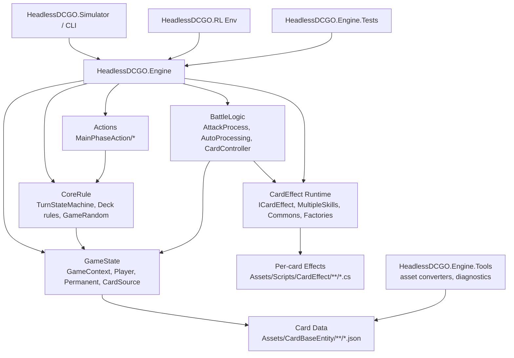
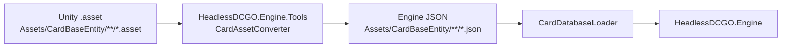

# .NET Headless Engine Program Structure

This structure is based on `docs/dotnet_source_classification.csv` after the latest source refresh.
The goal is to keep original DCGO locations recognizable while separating Unity/Photon/UI code from deterministic .NET battle logic.

## Design Principles

- Preserve source traceability: mirror `Assets/CardBaseEntity`, `Assets/Scripts/CardEffect`, and `Assets/Scripts/Script` inside the .NET engine project where practical.
- Remove Unity runtime dependencies from engine code: no `MonoBehaviour`, `GameObject`, `Transform`, `Coroutine`, `PhotonNetwork`, `UnityEngine.UI`, scene, sound, animation, or visual asset dependency in the core engine.
- Keep deterministic logic explicit: turn progression, action execution, effect scheduling, random number generation, and win/loss checks should run from plain state objects.
- Keep RL integration outside core rules: the engine exposes legal actions, observations, rewards, and terminal state; RL code consumes those APIs.
- Convert card master data once: Unity `.asset` files under `Assets/CardBaseEntity/**` become JSON or generated typed records, while `.meta` files stay ignored.

## Recommended Solution Layout

```text
E:/headlessDCGO_new/
  docs/
    dotnet_source_classification.csv
    dotnet_source_classification_summary.md
    dotnet_engine_program_structure.md

  src/
    HeadlessDCGO.Engine/
      HeadlessDCGO.Engine.csproj
      Assets/
        CardBaseEntity/
          README.md
          AD1/
          BT1/
          ...
        Scripts/
          CardEffect/
          Script/

    HeadlessDCGO.Engine.Tools/
      HeadlessDCGO.Engine.Tools.csproj
      AssetConversion/
      Diagnostics/

    HeadlessDCGO.Simulator/
      HeadlessDCGO.Simulator.csproj
      Program.cs
      Scenarios/

    HeadlessDCGO.RL/
      HeadlessDCGO.RL.csproj
      Environment/
      Observation/
      Reward/
      SelfPlay/

  tests/
    HeadlessDCGO.Engine.Tests/
      HeadlessDCGO.Engine.Tests.csproj
      Assets/
      Rules/
      Effects/
      Simulations/
```

## Engine Internal Layout

Keep the high-value source areas in nearly the same relative location as Unity:

```text
src/HeadlessDCGO.Engine/
  Assets/
    CardBaseEntity/
      AD1/
        Blue/
          Digimon/
            AD1_010.json
            AD1_011.json
      BT1/
      ...

    Scripts/
      Script/
        CEntity_Base.cs
        GameRandom.cs
        DeckData.cs
        DeckCodeUtility.cs
        DeckBuildingRule.cs
        DataBase.cs

        GameContext.cs
        Player.cs
        Permanent.cs
        CardSource.cs

        TurnStateMachine.cs
        AutoProcessing.cs
        AttackProcess.cs
        CardController.cs
        CardObjectController.cs

        ICardEffect.cs
        CardEffectInterfaces.cs
        SkillInfo.cs
        MultipleSkills.cs
        CardEffectCommons.cs
        CardEffectFactory.cs
        PermanentEffectFactory.cs

        MainPhaseAction/
          MainPhaseAction.cs
          PlayCardAction.cs
          PassAction.cs
          AttackPermanentAction.cs
          ActivateCardAction.cs
          ActivatePermanentAction.cs
          CheatAction.cs

        PlayerSelection/
          IPlayerSelection.cs
          CardSelection.cs
          PermanentSelection.cs
          ValueSelection.cs

        CardEffectCommons/
          CanUseEffects/
          GiveEffect/
          KeyWordEffects/
          MinMax_DP_Cost_Level/

        CardEffectFactory/
          KeyWordEffects/

        CardEffects/

        AutomaticOrder/
          StartTurnTamerMemory.cs

        DataTools/
          FilterCardList.cs
          GameplayOption.cs

      CardEffect/
        AD1/
        BT1/
        BT2/
        ...
```

The folder names intentionally resemble the original Unity project. Internally, namespaces can be cleaner, for example:

```csharp
namespace HeadlessDCGO.Engine.Assets.Scripts.Script;
namespace HeadlessDCGO.Engine.Assets.Scripts.CardEffect.BT1.Blue;
```

## Layer Diagram



## Original To .NET Mapping

| Original location | .NET location | Decision | Role |
|---|---|---:|---|
| `Assets/CardBaseEntity/**/*.asset` | `src/HeadlessDCGO.Engine/Assets/CardBaseEntity/**/*.json` | USE | Card master data for card pool, effects, cost, DP, color, card kind, text, set IDs |
| `Assets/CardBaseEntity/**/*.meta` | not copied | IGNORE | Unity metadata only |
| `Assets/Scripts/Script/CEntity_Base.cs` | same mirrored path | PORT | Card data model, remove `ScriptableObject`/sprite loading |
| `Assets/Scripts/Script/GameRandom.cs` | same mirrored path | USE | Deterministic PRNG, keep nearly as-is |
| `Assets/Scripts/Script/DeckData.cs` | same mirrored path | PORT | Deck encoding/decoding and deck card access |
| `Assets/Scripts/Script/DeckCodeUtility.cs` | same mirrored path | PORT | Deck-builder code parsing/export |
| `Assets/Scripts/Script/DeckBuildingRule.cs` | same mirrored path | PORT | Deck count, digitama, banlist checks |
| `Assets/Scripts/Script/GameContext.cs` | same mirrored path | PORT | Match-level state, turn player, phase, memory |
| `Assets/Scripts/Script/Player.cs` | same mirrored path | PORT | Player zones and queues; extract UI away |
| `Assets/Scripts/Script/Permanent.cs` | same mirrored path | PORT | Field stack/permanent state and DP/level/effect-derived values |
| `Assets/Scripts/Script/CardSource.cs` | same mirrored path | PORT | Runtime card instance state and playable checks |
| `Assets/Scripts/Script/TurnStateMachine.cs` | same mirrored path | PORT | Turn/phase flow, action handling, game end |
| `Assets/Scripts/Script/MainPhaseAction/*.cs` | same mirrored path | PORT | Headless action command surface |
| `Assets/Scripts/Script/AutoProcessing.cs` | same mirrored path | PORT | Rule timing, automatic processing, effect stack entry |
| `Assets/Scripts/Script/AttackProcess.cs` | same mirrored path | PORT | Attack state machine, block/counter/battle/end attack |
| `Assets/Scripts/Script/CardController.cs` | same mirrored path | PORT | Card play/digivolution/activation logic mixed with UI |
| `Assets/Scripts/Script/CardObjectController.cs` | same mirrored path | PORT | Zone movement logic mixed with object creation |
| `Assets/Scripts/Script/ICardEffect.cs` | same mirrored path | PORT | Effect base type and timing definitions |
| `Assets/Scripts/Script/CardEffectInterfaces.cs` | same mirrored path | PORT | Effect capability interfaces |
| `Assets/Scripts/Script/SkillInfo.cs` | same mirrored path | USE | Effect stack item |
| `Assets/Scripts/Script/MultipleSkills.cs` | same mirrored path | PORT | Effect resolution ordering and activation loop |
| `Assets/Scripts/Script/CardEffectCommons*` | same mirrored path | PORT | Shared effect predicates and state mutation helpers |
| `Assets/Scripts/Script/CardEffectFactory*` | same mirrored path | PORT | Shared effect factory helpers |
| `Assets/Scripts/CardEffect/**/*.cs` | same mirrored path | PORT | Per-card effect implementations |
| `Assets/Scripts/Script/FilterCardList.cs` | `Assets/Scripts/Script/DataTools/FilterCardList.cs` or same path | PORT | Card database filter predicates; remove UI widgets |
| `Assets/Scripts/Script/GameplayOption.cs` | `Assets/Scripts/Script/DataTools/GameplayOption.cs` or same path | PORT | Keep simulation-relevant option flags only |

## Core Engine API Shape

The engine should expose a small deterministic surface:

```csharp
public sealed class DcgoMatch
{
    public GameContext Context { get; }
    public IReadOnlyList<MainPhaseAction> GetLegalActions(PlayerId player);
    public StepResult Step(MainPhaseAction action);
    public Snapshot ExportSnapshot();
    public void LoadSnapshot(Snapshot snapshot);
}

public readonly record struct StepResult(
    GameContext Context,
    bool IsTerminal,
    PlayerId? Winner,
    IReadOnlyList<EffectEvent> Events);
```

This gives the simulator and RL adapter a stable entry point without referencing Unity update loops, UI events, Photon callbacks, or coroutines.

## Data Conversion Flow



Recommended converted data fields:

- `CardIndex`
- `CardID`
- `CardSpriteName`
- `SetID`
- `CardName_JPN`, `CardName_ENG`
- `CardKind`
- `CardColors`
- `PlayCost`
- `EvoCosts`
- `Level`
- `DP`
- `Rarity`
- `Form`, `Attribute`, `Type`
- `EffectDescription`, `InheritedEffectDescription`, `SecurityEffectDescription`
- `CardEffectClassName`
- `OverflowMemory`
- `LinkDP`, `LinkEffect`, `LinkRequirement`
- `OptionCardColorRequirements`, `OptionEffect`
- `MaxCountInDeck`
- `Parallel` marker if needed

## Coroutine Replacement Model

Unity currently expresses many effects as `IEnumerator` plus `yield return StartCoroutine(...)`.
In the .NET engine, replace this with an explicit effect operation queue:

```text
EffectScheduler
  Enqueue(EffectOperation)
  ResolveNext()
  ResolveUntilStable()

EffectOperation
  SourceCard
  Timing
  Condition(context)
  Execute(context) -> EffectResult
```

Mapping:

| Unity pattern | .NET replacement |
|---|---|
| `IEnumerator` effect body | `EffectOperation.Execute()` |
| `yield return StartCoroutine(...)` | enqueue child operation or call deterministic service |
| `WaitForSeconds`, animation wait | ignored or converted to event marker |
| UI selection coroutine | request action/choice from policy via `IChoiceProvider` |
| `GManager.instance` singleton | explicit `GameContext`, `EngineServices`, `EffectScheduler` parameters |
| Photon RPC action | local `MainPhaseAction` command |

## Runtime Components

```text
HeadlessDCGO.Engine
  CardDatabase
    CardEntity
    CardDatabaseLoader
    CardIndex

  Match
    DcgoMatch
    MatchConfig
    MatchFactory
    Snapshot

  State
    GameContext
    Player
    CardSource
    Permanent
    Zones

  Rules
    TurnStateMachine
    PhaseService
    DeckBuildingRule
    MemoryRule
    WinLossRule

  Actions
    MainPhaseAction
    PlayCardAction
    AttackPermanentAction
    ActivateCardAction
    ActivatePermanentAction
    PassAction

  Battle
    AttackProcess
    BattleResolver
    SecurityCheckResolver

  Effects
    ICardEffect
    EffectTiming
    EffectScheduler
    SkillInfo
    MultipleSkills
    CardEffectCommons
    CardEffectFactory
    PermanentEffectFactory

  Selection
    IChoiceProvider
    AutoChoiceProvider
    PolicyChoiceProvider
    CardSelection
    PermanentSelection
    ValueSelection

  Simulation
    LegalActionGenerator
    DeterministicStepper
    EventLog
```

## RL Project Structure

```text
src/HeadlessDCGO.RL/
  Environment/
    DcgoEnvironment.cs
    DcgoEnvironmentConfig.cs
    EpisodeResult.cs

  Observation/
    ObservationEncoder.cs
    ActionMaskEncoder.cs
    PublicStateProjection.cs
    PrivateStateProjection.cs

  Reward/
    RewardModel.cs
    WinLossReward.cs
    ShapedReward.cs

  SelfPlay/
    SelfPlayRunner.cs
    PolicyAdapter.cs
```

The RL layer should not own rules. It should only convert engine state into observations/action masks and call `DcgoMatch.Step(action)`.

## First Implementation Pass

1. Create `HeadlessDCGO.Engine` project with mirrored `Assets/Scripts/Script` folders.
2. Convert a small subset of `Assets/CardBaseEntity/**/*.asset` to JSON and load it.
3. Port `GameRandom.cs` as-is and add seed tests.
4. Port minimal data models: `CEntity_Base`, `DeckData`, `GameContext`, `Player`, `CardSource`, `Permanent`.
5. Port `MainPhaseAction` command classes without Photon serialization dependency.
6. Extract the phase skeleton from `TurnStateMachine.cs`: start game, active, draw, breeding, main, end.
7. Add a no-effect smoke simulation: initialize decks, draw, pass turns, detect deck-out/security win conditions where possible.
8. Introduce `EffectScheduler`, then port `ICardEffect`, `SkillInfo`, `MultipleSkills`, and shared commons.
9. Port a tiny first batch of card effects and test them against known scenarios.
10. Add RL-facing `GetLegalActions`, `Step`, `ExportSnapshot`, and action mask encoding.

## What Not To Copy Into Engine

- `*.meta`
- Unity scenes, prefabs, animations, audio, shaders, fonts
- UI panels, modals, buttons, text links, profile screens
- Photon client networking and lobby/room code
- `Library`, `Temp`, `Client`, package cache, build outputs
- Card images unless a separate visualization/debug tool wants them

