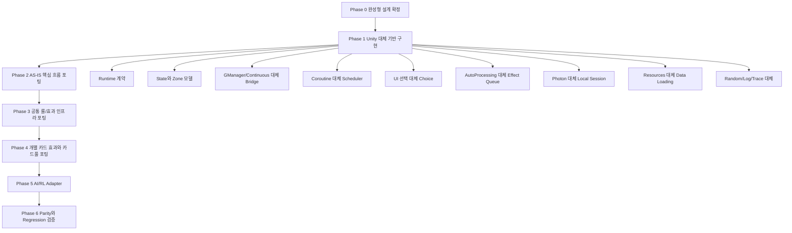

# HeadlessDCGO.Engine 재설계: Unity 대체 기반 우선 구조

## 결론

HeadlessDCGO.Engine의 최초 설계 이후 첫 구현 대상은 **Unity 대체 기반**이어야 한다. 이 기반이 완성되기 전에는 `Assets/...` 룰, 카드 효과, 전투 로직 포팅을 시작하지 않는다.

이유는 간단하다. 포팅 대상 파일들은 `GManager.instance`, `ContinuousController.instance`, `MonoBehaviour`, `Coroutine`, `GameObject`, `Transform`, `Select*Effect`, `Resources`, `Photon`, `Debug.Log`, Unity random/frame timing에 강하게 얽혀 있다. 이 의존을 받을 Headless 기준이 먼저 닫히지 않으면 파일마다 서로 다른 치환 방식이 생기고, 이후 룰/효과 포팅의 기준이 계속 흔들린다.

따라서 전체 순서는 다음으로 고정한다.

1. 완성형 설계 확정
2. **Unity 대체 기반 구현 완료**
3. AS-IS 핵심 흐름 포팅
4. 공통 룰/효과 인프라 포팅
5. 개별 카드 효과와 카드풀 포팅
6. AI/RL adapter와 batch simulation
7. parity와 regression 검증

이 문서는 실제 C# 구현을 수행하지 않는다. 원본 `DCGO/Assets/...` 파일과 카드 효과 asset 포팅 파일도 수정하지 않는다.

## 분석 기준

기존 분석 결과를 설계 범위의 기준으로 사용한다.

- 원본 검사 루트: `DCGO/Assets`
- 원본 C# 파일 수: 4,765
- 파싱된 메서드 수: 8,452
- Unity 의존 메서드 수: 8,236
- Headless 대체 대상 Unity 의존 메서드 수: 7,395
- 클라이언트 전용으로 제외 가능한 메서드 수: 841
- .NET 엔진 생성 대상 파일 수: 12,574
  - `USE`: 8,316
  - `PORT`: 4,258

주요 원본 핵심 파일/루트는 다음과 같다.

- `DCGO/Assets/Scripts/Script/GManager.cs`
- `DCGO/Assets/Scripts/Script/ContinuousController.cs`
- `DCGO/Assets/Scripts/Script/TurnStateMachine.cs`
- `DCGO/Assets/Scripts/Script/AutoProcessing.cs`
- `DCGO/Assets/Scripts/Script/AttackProcess.cs`
- `DCGO/Assets/Scripts/Script/GameContext.cs`
- `DCGO/Assets/Scripts/Script/Player.cs`
- `DCGO/Assets/Scripts/Script/CardController.cs`
- `DCGO/Assets/Scripts/Script/CardObjectController.cs`
- `DCGO/Assets/Scripts/Script/CardEffectFactory`
- `DCGO/Assets/Scripts/Script/CardEffectCommons`
- `DCGO/Assets/Scripts/Script/CardEffects`
- `DCGO/Assets/Scripts/Script/MainPhaseAction`
- `DCGO/Assets/Scripts/Script/Select*Effect.cs`
- `DCGO/Assets/CardBaseEntity`

## 핵심 설계 원칙

`Headless/`는 원본 게임 규칙을 새로 쓰는 위치가 아니다. `Headless/`는 Unity가 맡던 실행 환경을 .NET에서 대체하는 기반 계층이다.

최종 구조는 다음 원칙을 따른다.

- 원본 룰/카드 효과 로직은 가능한 한 `src/HeadlessDCGO.Engine/Assets/...`의 대응 위치로 포팅한다.
- `src/HeadlessDCGO.Engine/Headless/...`는 Unity 런타임 의존을 받는 기반이다.
- 포팅된 룰/효과 코드는 Unity API를 직접 호출하지 않고 Headless service와 context만 사용한다.
- 모든 상태 변경은 권위 있는 state model을 통해서만 발생한다.
- 모든 상태 변경은 event와 trace로 남겨 재현 가능해야 한다.
- AI/RL은 Unity 화면이 아니라 observation, legal action, action mask, reward, terminal result만 본다.

## 테스트 원칙

모든 Phase와 세부 작업은 단위테스트와 단위테스트 결과 문서를 함께 남겨야 완료로 인정한다.

공통 원칙은 다음과 같다.

- 구현 산출물이 있는 작업은 반드시 대응 단위테스트를 가진다.
- 단위테스트가 없는 구현 작업은 완료로 보지 않는다.
- 단위테스트 실행 결과는 `docs/test-results/` 아래 Markdown 문서로 남긴다.
- 결과 문서에는 실행 일시, 대상 Phase, 테스트 명령, 통과/실패 수, 실패 목록, 미해결 리스크를 포함한다.
- Phase 완료 게이트는 코드 구현 여부가 아니라 단위테스트와 결과 문서까지 포함한다.
- Phase 내부 작업은 Goal 단위로 쪼개며 각 Goal은 별도 단위테스트와 결과 문서를 가진다.
- 테스트가 아직 작성될 수 없는 순수 설계 단계는 문서 검증 테스트 또는 설계 체크리스트 결과 문서를 남긴다.
- 후속 Phase로 넘어갈 때 이전 Phase의 실패 테스트가 남아 있으면 안 된다.

## 재설계된 전체 구조

## Phase 1: Unity 대체 기반의 범위

Unity 대체 기반은 후속 포팅이 의존할 표준 API를 제공한다. 이 단계의 산출물은 실제 DCGO 카드 효과 전체 구현이 아니라, 카드 효과와 룰을 포팅할 때 더 이상 Unity 의존 치환 기준을 새로 만들지 않게 하는 완성된 기반이다.

### 1. Runtime Contract

역할:

- 매치 초기화, reset, step, action 적용, observation, legal action, result 반환 계약을 고정한다.
- 포팅된 `TurnStateMachine`, `AutoProcessing`, `AttackProcess`, `MainPhaseAction`이 붙을 실행 표면을 제공한다.

필수 API:

- `DcgoMatch.Initialize`
- `DcgoMatch.Reset`
- `DcgoMatch.Step`
- `DcgoMatch.ApplyAction`
- `DcgoMatch.Observe`
- `DcgoMatch.GetLegalActions`
- `DcgoMatch.GetResult`

완료 기준:

- Unity scene 없이 match를 구성하고 실행할 public contract가 확정되어 있다.
- 후속 포팅 코드가 runtime 진입점을 새로 만들 필요가 없다.

### 2. Authoritative State And Zone Kernel

역할:

- Unity `GameObject`, `Transform`, scene hierarchy가 맡던 카드 위치와 상태를 데이터 모델로 대체한다.
- 카드 이동과 상태 변경의 source of truth를 고정한다.

필수 모델:

- `MatchState`
- `PlayerState`
- `CardInstanceState`
- `ZoneState`
- `MemoryState`
- `PhaseState`
- `PendingChoiceState`
- `PendingEffectState`

필수 zone:

- deck
- hand
- field
- raising
- trash
- security
- digivolution cards
- linked cards
- reveal
- execution
- transient gameplay area

완료 기준:

- 포팅 코드가 카드 위치 확인이나 이동을 위해 `Transform` 또는 `GameObject`를 찾지 않는다.
- 모든 zone movement는 `IZoneMover` 또는 동등한 state mutation service를 통과한다.

### 3. Bridge And Runtime Context

역할:

- `GManager.instance`, `ContinuousController.instance`, `GetComponent<T>()`, scene object lookup을 Headless context로 대체한다.

필수 구성:

- `EngineContext`
- `GManagerBridge`
- `ContinuousContext`
- `UnityNullObjectPolicy`

완료 기준:

- 게임플레이에 필요한 기존 global access가 모두 Headless service 접근으로 매핑되어 있다.
- UI, scene, animation 전용 access는 제외 사유가 문서화되어 있다.

### 4. Coroutine And Scheduling Replacement

역할:

- `IEnumerator`, `StartCoroutine`, `WaitForSeconds`, `WaitWhile`, nested coroutine을 deterministic engine task로 대체한다.

필수 구성:

- `IEngineTask`
- `EngineTaskRunner`
- `CoroutineAdapter`
- `EngineWaitCondition`

완료 기준:

- 포팅된 gameplay coroutine이 frame rate나 wall clock 없이 실행될 수 있다.
- 선택 대기, 효과 대기, phase progression이 명시적 pending state로 표현된다.

### 5. Choice Replacement

역할:

- `SelectCardEffect`, `SelectPermanentEffect`, `SelectCountEffect`, `SelectHandEffect`, `SelectAttackEffect`, `PlayerSelection/*`를 UI 없이 처리한다.

필수 구성:

- `ChoiceRequest`
- `ChoiceCandidate`
- `ChoiceResult`
- `ChoiceType`
- `ChoiceZone`
- `IChoiceProvider`
- scripted provider
- policy provider

완료 기준:

- 게임플레이에 영향을 주는 모든 선택은 choice request/result로 표현된다.
- 선택 후보, 선택 수 하한/상한, skip 가능 여부, zone, visibility가 데이터로 들어간다.

### 6. Effect Queue And Timing Foundation

역할:

- `AutoProcessing`, `MultipleSkills`, `Effects`, `GetComponent<Effects>()`, `Hashtable` 기반 effect context를 받을 기반을 만든다.

필수 구성:

- `EffectScheduler`
- `EffectResolutionQueue`
- `EffectContext`
- `EffectRequest`
- `EffectResult`
- `PendingEffect`
- timing window resolver contract
- effect registry contract
- replacement/continuous effect query contract

완료 기준:

- 자동 효과와 optional effect가 queue로 표현된다.
- effect resolution은 choice에서 멈추고 재개될 수 있다.
- 포팅될 카드 효과가 Unity component를 찾지 않고 effect context와 service를 사용한다.

### 7. Local Session And Action Event Replacement

역할:

- Photon room, player, RPC, ownership, network callback을 local deterministic match context로 대체한다.

필수 구성:

- `HeadlessPlayerId`
- action queue
- local session context
- game event stream
- replayable action record

완료 기준:

- 게임플레이에 영향을 주는 RPC 흐름은 action, choice, game event 중 하나로 매핑된다.
- Headless core는 Photon을 참조하지 않는다.

### 8. Data Loading Contract

역할:

- Unity `Resources`, ScriptableObject runtime loading, prefab dependency를 .NET file/data loading으로 대체한다.

필수 구성:

- `CardDatabase`
- `CardAssetJsonLoader`
- `DeckListLoader`
- `BanlistLoader`
- `ICardRepository`

완료 기준:

- 카드 데이터와 덱 데이터는 Unity runtime 없이 로드된다.
- image, prefab, audio, animation은 core gameplay data에서 제외된다.

### 9. Determinism And Diagnostics

역할:

- Unity random, Debug.Log, PlayLog, frame time 의존을 deterministic random과 trace로 대체한다.

필수 구성:

- `IRandomSource`
- seedable random implementation
- `ILogSink`
- `EngineTrace`
- trace event
- deterministic fingerprint

완료 기준:

- 같은 seed, 같은 deck, 같은 action sequence는 같은 trace를 만든다.
- 모든 상태 변경은 재현 가능한 event로 남는다.

## Phase 1 완료 게이트

아래 조건이 모두 만족되어야 AS-IS 핵심 룰/효과 포팅을 시작할 수 있다.

- `GManager.instance` 대체 기준이 확정되어 있다.
- `ContinuousController.instance` 대체 기준이 확정되어 있다.
- `MonoBehaviour` lifecycle 대체 기준이 확정되어 있다.
- `StartCoroutine`, `IEnumerator`, `WaitForSeconds`, `WaitWhile` 대체 기준이 확정되어 있다.
- `GameObject`, `Transform`, `GetComponent`, `Instantiate`, `Destroy` 대체 기준이 확정되어 있다.
- `Select*Effect`와 `PlayerSelection/*` 대체 기준이 확정되어 있다.
- `AutoProcessing`, `MultipleSkills`, `Effects`, `Hashtable` effect context 대체 기준이 확정되어 있다.
- `Photon`, RPC, room/player/network callback 대체 기준이 확정되어 있다.
- `Resources`, ScriptableObject, prefab 기반 gameplay data loading 대체 기준이 확정되어 있다.
- `Debug.Log`, `PlayLog`, Unity random, frame time 대체 기준이 확정되어 있다.
- 위 기준이 문서와 API에 반영되어 있고 후속 포팅자가 파일마다 새 기준을 만들 필요가 없다.
- Phase 1 범위의 단위테스트가 작성되어 있다.
- Phase 1 단위테스트 결과 문서가 `docs/test-results/headless_phase1_unity_replacement_unit_test_results.md`에 남아 있다.
- Phase 1 단위테스트가 통과하지 않으면 Phase 2 포팅을 시작하지 않는다.

## Phase 1 이후에만 진행할 작업

### Phase 2: AS-IS 핵심 흐름 포팅

대상:

- `GManager.cs`
- `ContinuousController.cs`
- `TurnStateMachine.cs`
- `GameContext.cs`
- `Player.cs`
- `CardController.cs`
- `CardObjectController.cs`
- `AutoProcessing.cs`
- `AttackProcess.cs`
- `MainPhaseAction/*.cs`

목표:

- Unity 대체 기반 위에서 실제 턴, 페이즈, 액션, 공격, 자동 효과 흐름을 연결한다.

### Phase 3: 공통 룰/효과 인프라 포팅

대상:

- `ICardEffect.cs`
- `CardEffectInterfaces.cs`
- `SkillInfo.cs`
- `CardEffectCommons`
- `CardEffectFactory`
- `PermanentEffectFactory.cs`
- requirement, condition, cost, modifier helper

목표:

- 개별 카드 효과가 공통으로 사용할 typed effect/rule helper를 완성한다.

### Phase 4: 개별 카드 효과와 카드풀 포팅

대상:

- `CardEffects`
- `CardEffectFactory/KeyWordEffects`
- `CardEffectCommons/KeyWordEffects`
- `Assets/CardBaseEntity`

목표:

- 대상 card pool을 실제로 플레이 가능하게 만든다.

### Phase 5: AI/RL Adapter

대상:

- observation encoder
- action mask
- reward calculator
- batch episode runner
- dataset exporter

목표:

- 이미 완성된 Headless 게임 실행기를 학습 시스템에 연결한다.

중요: 이 단계는 Unity 대체 기반의 선행 조건이 아니다. RL adapter는 Headless 실행 기반과 게임 룰 포팅 이후 확장 단계다.

### Phase 6: Parity And Regression

목표:

- Unity AS-IS curated scenario와 Headless 결과를 비교한다.
- deterministic replay와 regression suite로 포팅 신뢰성을 확보한다.
