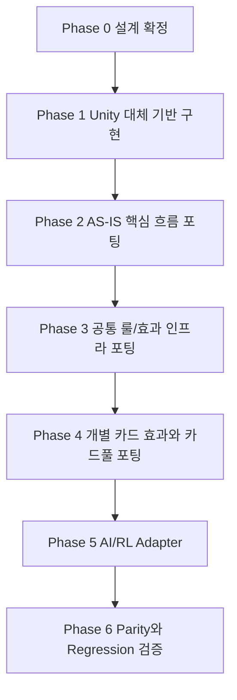

# HeadlessDCGO.Engine 재설계 포팅 순서

## 핵심 변경

이 문서는 이전 순서에서 흐려졌던 기준을 바로잡는다.

**Unity 대체 기반은 후속 작업이 아니라 최초 설계 직후의 1차 구현 대상이다.**

`Assets/...` 룰/카드 효과 포팅은 Unity 대체 기반이 완료된 뒤에 시작한다. 그렇지 않으면 파일마다 `GManager`, coroutine, `GameObject`, `Select*Effect`, Photon, Resources를 서로 다르게 치환하게 되고 전체 포팅 기준이 깨진다.

## 테스트와 결과 문서 원칙

모든 Phase는 단위테스트와 단위테스트 결과 문서를 완료 조건에 포함한다.

- Phase별 구현 산출물은 반드시 대응 단위테스트를 가진다.
- 테스트가 없는 기능은 완료로 처리하지 않는다.
- 각 Phase 완료 시 `docs/test-results/` 아래에 단위테스트 결과 문서를 남긴다.
- 결과 문서에는 테스트 명령, 테스트 대상, 통과/실패 수, 실패 상세, 미해결 리스크, 다음 조치를 포함한다.
- 실패 테스트가 남아 있으면 다음 Phase로 넘어가지 않는다.
- 설계만 수행하는 Phase 0도 문서 검증 결과를 남긴다.

## 전체 순서

## Phase 0: 완성형 설계 확정

목표:

- 최종 완성형 구조를 정의한다.
- Unity 대체 기반의 범위와 완료 조건을 먼저 고정한다.
- 후속 포팅이 의존할 API와 책임 경계를 문서화한다.

산출물:

- `docs/headless_complete_architecture_design.md`
- `docs/headless_complete_architecture_modules.csv`
- `docs/headless_complete_dependency_replacement.csv`
- `docs/headless_complete_porting_sequence.md`
- `docs/headless_complete_unit_test_plan.md`
- `docs/headless_complete_unit_test_matrix.csv`
- `docs/headless_complete_goal_breakdown.md`
- `docs/headless_complete_goal_breakdown.csv`
- `docs/headless_complete_goal_breakdown_ko.csv`
- `docs/headless_complete_goal_breakdown_detailed_ko.csv`
- `docs/headless_goal_prompts_compact_ko.csv`
- `docs/headless_goal_prompt_usage.md`
- `docs/headless_goal_spec_index.csv`
- `docs/headless_goal_spec_template.md`
- `docs/headless_goal_execution_prompt.md`
- `docs/goal-specs/*.md`

완료 기준:

- Unity 대체 기반이 후속이 아니라 1차 구현 대상임이 명확하다.
- `Headless/`와 `Assets/...`의 역할이 분리되어 있다.
- 실제 asset/card effect 포팅을 시작하기 전 필요한 기반 모듈이 식별되어 있다.
- 설계 문서 검증 결과가 `docs/test-results/headless_phase0_design_validation_results.md`에 남아 있다.
- Goal 단위 작업 분해가 문서화되어 있다.
- 실제 Goal 입력용 짧은 프롬프트 CSV가 존재한다.
- Goal 단위 작업 분해 CSV 자체에 상세 목표 설명, 해야 할 작업, 금지 작업, 테스트 상세, 완료 체크리스트가 포함되어 있다.
- 각 Goal별 상세 지시서가 `docs/goal-specs/` 아래에 존재한다.
- Goal 실행 시 사용할 목표 프롬프트가 문서화되어 있다.

## Phase 1: Unity 대체 기반 구현

목표:

- AS-IS 포팅 코드가 더 이상 Unity 의존 치환 기준을 새로 만들지 않도록 Headless 기반 API를 완성한다.
- 이 단계가 끝나기 전에는 `Assets/...` 룰/효과 포팅을 시작하지 않는다.

### Phase 1A: Runtime Contract

대상:

- `DcgoMatch`
- `HeadlessGameLoop`
- `MatchConfig`
- `StepResult`
- `MatchResult`
- `GameEvent`
- `HeadlessAction`
- `LegalAction`

완료 기준:

- match initialize, reset, step, apply action, observe, legal action, result API가 확정된다.
- 후속 포팅 코드가 runtime 진입점을 새로 만들 필요가 없다.
- Runtime contract 단위테스트와 결과 문서가 작성된다.

### Phase 1B: Authoritative State And Zone Kernel

대상:

- `MatchState`
- `PlayerState`
- `CardInstanceState`
- `ZoneState`
- `MemoryState`
- `PhaseState`
- `PendingChoiceState`
- `PendingEffectState`
- `IZoneMover`
- `IZoneStateReader`

완료 기준:

- 카드 위치와 상태가 `GameObject`나 `Transform`이 아니라 data model로 표현된다.
- 모든 zone 이동은 단일 mutation boundary를 통과한다.
- deck, hand, field, raising, trash, security, source, linked card, reveal, execution 영역이 표현된다.
- State/Zone 단위테스트와 결과 문서가 작성된다.

### Phase 1C: Bridge And Context

대상:

- `EngineContext`
- `GManagerBridge`
- `ContinuousContext`
- `UnityNullObjectPolicy`

완료 기준:

- `GManager.instance` 대체 접근점이 확정된다.
- `ContinuousController.instance` 대체 접근점이 확정된다.
- gameplay-relevant global field와 service가 Headless context로 매핑된다.
- UI/scene/animation-only field는 제외 사유가 문서화된다.
- Bridge/Context 단위테스트와 결과 문서가 작성된다.

### Phase 1D: Coroutine Replacement

대상:

- `IEngineTask`
- `EngineTaskRunner`
- `CoroutineAdapter`
- `EngineWaitCondition`

완료 기준:

- `IEnumerator`, `StartCoroutine`, `WaitForSeconds`, `WaitWhile`의 gameplay 의미가 deterministic scheduler로 표현된다.
- frame rate나 wall clock이 gameplay outcome을 바꾸지 않는다.
- Coroutine replacement 단위테스트와 결과 문서가 작성된다.

### Phase 1E: Choice Replacement

대상:

- `ChoiceRequest`
- `ChoiceCandidate`
- `ChoiceOption`
- `ChoiceResult`
- `ChoiceType`
- `ChoiceZone`
- `IChoiceProvider`
- `ScriptedChoiceProvider`
- `PolicyChoiceProvider`

완료 기준:

- `SelectCardEffect`, `SelectPermanentEffect`, `SelectCountEffect`, `SelectHandEffect`, `SelectAttackEffect`, `PlayerSelection/*`를 받을 수 있다.
- 선택 후보, 선택 수 하한/상한, skip 가능 여부, zone, visibility가 모두 data로 표현된다.
- Choice replacement 단위테스트와 결과 문서가 작성된다.

### Phase 1F: Effect Queue And Timing Foundation

대상:

- `EffectScheduler`
- `EffectResolutionQueue`
- `EffectContext`
- `EffectRequest`
- `EffectResult`
- `PendingEffect`
- effect registry contract
- timing window resolver contract
- continuous/replacement effect query contract

완료 기준:

- `AutoProcessing`, `MultipleSkills`, `Effects`, `GetComponent<Effects>()`가 향후 붙을 기준 API가 있다.
- automatic effect, optional effect, delayed effect가 queue와 timing window로 표현된다.
- effect resolution은 choice에서 멈추고 다시 진행될 수 있다.
- Effect queue/timing foundation 단위테스트와 결과 문서가 작성된다.

### Phase 1G: Local Session And Network Replacement

대상:

- `HeadlessPlayerId`
- local player/session context
- action queue
- replayable action record
- event stream

완료 기준:

- Photon player, room, ownership, RPC, callback의 gameplay 의미가 local action/session/event로 매핑된다.
- Headless core가 Photon을 참조하지 않는다.
- Local session/network replacement 단위테스트와 결과 문서가 작성된다.

### Phase 1H: Data Loading Contract

대상:

- `CardDatabase`
- `CardAssetJsonLoader`
- `DeckListLoader`
- `BanlistLoader`
- `ICardRepository`
- `ICardInstanceRepository`

완료 기준:

- 카드 정의와 decklist는 Unity `Resources`, ScriptableObject runtime loading, prefab 없이 로드된다.
- image, audio, animation, prefab은 gameplay data에서 제외된다.
- Data loading contract 단위테스트와 결과 문서가 작성된다.

### Phase 1I: Determinism And Diagnostics

대상:

- `IRandomSource`
- deterministic random implementation
- `ILogSink`
- `EngineTrace`
- `TraceEvent`
- trace fingerprint

완료 기준:

- 같은 seed, decklist, action sequence가 같은 trace를 만든다.
- `Debug.Log`, `PlayLog`, Unity random, frame time 의존이 Headless service로 대체된다.
- Determinism/diagnostics 단위테스트와 결과 문서가 작성된다.

## Phase 1 완료 게이트

다음 항목을 모두 만족해야 Phase 2로 넘어갈 수 있다.

- 후속 포팅자가 `GManager.instance`를 어디로 바꿀지 새로 결정하지 않아도 된다.
- 후속 포팅자가 `ContinuousController.instance`를 어디로 바꿀지 새로 결정하지 않아도 된다.
- 후속 포팅자가 coroutine을 어떻게 바꿀지 새로 결정하지 않아도 된다.
- 후속 포팅자가 `GameObject`, `Transform`, `GetComponent`, `Instantiate`, `Destroy`를 어떻게 바꿀지 새로 결정하지 않아도 된다.
- 후속 포팅자가 `Select*Effect`를 UI로 볼지 룰 선택으로 볼지 고민하지 않아도 된다.
- 후속 포팅자가 `AutoProcessing`과 effect queue 기준을 새로 만들지 않아도 된다.
- 후속 포팅자가 Photon/RPC 흐름을 action인지 event인지 session인지 새로 판단하지 않아도 된다.
- 후속 포팅자가 Resources/ScriptableObject/prefab loading을 어떻게 바꿀지 새로 정하지 않아도 된다.
- 후속 포팅자가 random/log/time/frame 의존을 임의로 처리하지 않아도 된다.
- Phase 1 전체 단위테스트가 통과한다.
- Phase 1 결과 문서가 `docs/test-results/headless_phase1_unity_replacement_unit_test_results.md`에 남아 있다.

이 게이트가 닫히기 전에는 asset/card effect 포팅을 시작하지 않는다.

## Phase 2: AS-IS 핵심 흐름 포팅

목표:

- Phase 1 기반 위에 실제 DCGO 턴, 페이즈, 액션, 공격, 자동 효과 흐름을 연결한다.

대상:

- `GManager.cs`
- `ContinuousController.cs`
- `TurnStateMachine.cs`
- `GameContext.cs`
- `Player.cs`
- `CardController.cs`
- `CardObjectController.cs`
- `AutoProcessing.cs`
- `AttackProcess.cs`
- `MainPhaseAction/*.cs`

완료 기준:

- Unity 없이 턴/페이즈 진행이 가능하다.
- legal action 생성과 action 적용 흐름이 Runtime/State/Services 기준으로 동작한다.
- 공격과 시큐리티 처리의 기본 흐름이 Headless state에서 동작한다.
- 자동 효과 수집과 queue 연결이 실제 AS-IS 흐름과 연결된다.
- Phase 2 단위테스트가 통과한다.
- Phase 2 결과 문서가 `docs/test-results/headless_phase2_core_flow_unit_test_results.md`에 남아 있다.

## Phase 3: 공통 룰/효과 인프라 포팅

목표:

- 개별 카드 효과가 공통으로 사용할 helper와 effect binding 기반을 완성한다.

대상:

- `ICardEffect.cs`
- `CardEffectInterfaces.cs`
- `SkillInfo.cs`
- `CardEffectCommons`
- `CardEffectFactory`
- `PermanentEffectFactory.cs`
- requirement helper
- condition helper
- cost helper
- modifier helper
- keyword base effect

완료 기준:

- 공통 helper가 Unity, Photon, UI, GameObject, coroutine frame timing, `Hashtable` final API에 의존하지 않는다.
- 개별 card effect가 typed context와 services만으로 구현 가능하다.
- Phase 3 단위테스트가 통과한다.
- Phase 3 결과 문서가 `docs/test-results/headless_phase3_shared_rule_effect_unit_test_results.md`에 남아 있다.

## Phase 4: 개별 카드 효과와 카드풀 포팅

목표:

- 대상 card pool을 실제로 플레이 가능하게 만든다.

대상:

- `CardEffects`
- `CardEffectFactory/KeyWordEffects`
- `CardEffectCommons/KeyWordEffects`
- `Assets/CardBaseEntity`

완료 기준:

- 대상 card pool의 모든 카드가 complete Headless behavior를 가지거나 명시 제외되어 있다.
- 대표 mechanic별 parity scenario가 통과된다.
- effect ordering과 optional prompt가 AS-IS behavior와 일치한다.
- Phase 4 단위테스트가 통과한다.
- Phase 4 결과 문서가 `docs/test-results/headless_phase4_card_pool_unit_test_results.md`에 남아 있다.

## Phase 5: AI/RL Adapter

목표:

- 완성된 Headless game execution을 AI/RL 학습 시스템에 연결한다.

대상:

- observation encoder
- action mask
- reward calculator
- batch episode runner
- parallel simulation
- dataset exporter

완료 기준:

- AI policy가 observation과 legal action만으로 full match를 플레이할 수 있다.
- hidden information이 player별로 올바르게 masking된다.
- parallel simulation이 seed별 deterministic result를 만든다.
- Phase 5 단위테스트가 통과한다.
- Phase 5 결과 문서가 `docs/test-results/headless_phase5_rl_adapter_unit_test_results.md`에 남아 있다.

중요:

- Phase 5는 Unity 대체 기반의 선행 조건이 아니다.
- RL adapter는 Phase 1 기반과 Phase 2~4 gameplay porting 이후 확장되는 계층이다.

## Phase 6: Parity And Regression

목표:

- Headless behavior가 AS-IS Unity gameplay와 일치함을 검증한다.

산출물:

- scenario runner
- replay runner
- golden trace
- rule unit test
- effect unit test
- full-match scripted test
- determinism test
- performance benchmark

완료 기준:

- curated Unity AS-IS scenario와 Headless scenario가 같은 state transition과 terminal result를 만든다.
- 같은 Headless replay가 동일한 trace fingerprint를 만든다.
- regression suite가 setup, phase flow, memory, deck/hand/security/trash/field movement, combat, security, representative effects를 포함한다.
- Phase 6 단위테스트와 regression test가 통과한다.
- Phase 6 결과 문서가 `docs/test-results/headless_phase6_parity_regression_test_results.md`에 남아 있다.
