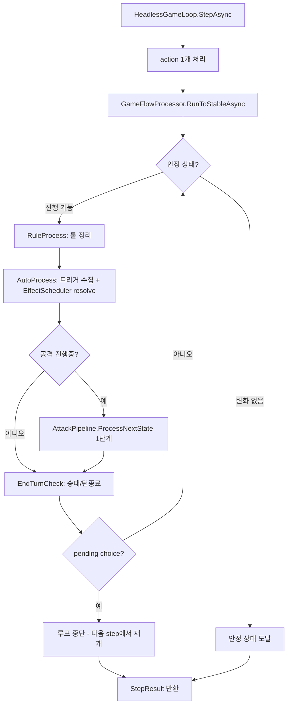
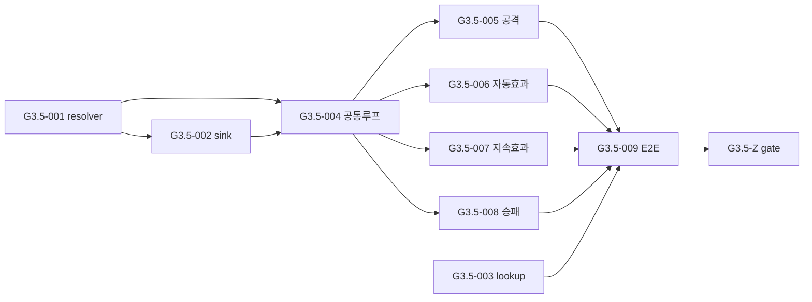
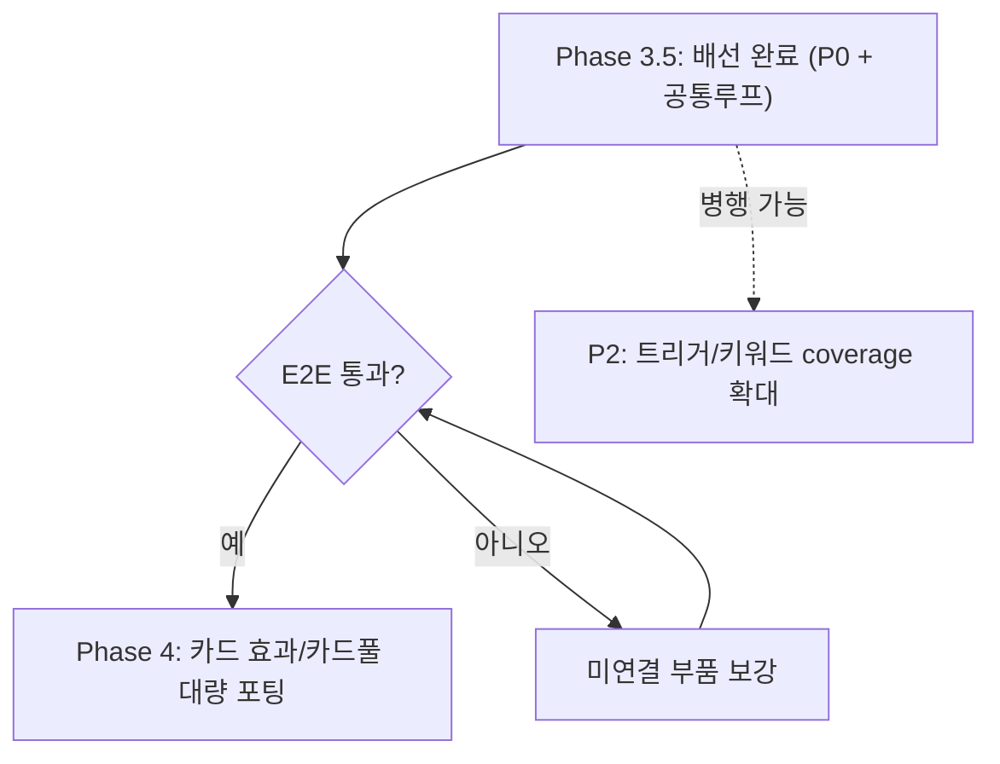

# Phase 3.5 통합 수정 설계안

- 작성일: 2026-06-25
- 위치: Phase 3(완료)와 Phase 4(카드 포팅) 사이에 두는 **별도 통합 Phase**
- 근거 문서: [audit/README.md](audit/README.md), [audit/phase3_parity_audit_report.md](audit/phase3_parity_audit_report.md), [audit/engine_flow_asis_vs_tobe.md](audit/engine_flow_asis_vs_tobe.md)
- 결정 사항(확정):
  1. 통합 수정은 **별도 Phase 3.5**로 진행
  2. 시작 지점은 **P0**부터
  3. **"공통 루프 이식" 설계를 최우선**으로 작성 (이 문서)

---

## 1. Phase 3.5 정의

### 목표

> Phase 3에서 만든 helper/contract를 **실제 게임 루프에 연결**하여, Unity AS-IS와 동일한 흐름으로 동작하는 최소 실행 엔진을 만든다.

Phase 3.5는 **새 카드 효과를 추가하지 않는다.** 이미 있는 부품의 **배선**만 한다.

### 완료 기준 (gate)

- P0 결함 3건 수정 + 단위테스트
- 공통 처리 루프(`GameFlowProcessor`)가 `HeadlessGameLoop`에 이식됨
- 대표 카드 소수로 declare→block→battle→security→end-attack E2E 통과
- 모든 goal에 단위테스트 + 결과 문서 (기존 Phase 관례 유지)

### 테스트 원칙 (기존 관례 계승)

- 구현 산출물이 있는 goal은 반드시 대응 단위테스트를 가진다.
- 결과는 `docs/test-results/goals/`에 Markdown으로 남긴다.
- 이전 goal 실패가 남아 있으면 다음 goal로 넘어가지 않는다.

---

## 2. 공통 루프 이식 설계 (최우선)

### 2.1 AS-IS가 실제로 하는 일

원본 `TurnStateMachine`의 모든 phase는 아래 3개를 **안정 상태가 될 때까지 교차 반복**한다.

```
AutoProcessCheck()              // 룰처리 → 타이밍 스킬 수집 → 트리거 효과 해결
   ↕
attackProcess.ProcessNextState() // 공격 state 1단계 진행 (Counter/Block/Battle/End/CleanUp)
   ↕
EndTurnCheck()                  // 승패/턴종료 조건 확인
```

`AutoProcessCheck()` 내부 (원본 `AutoProcessing.cs:122`):

```
RuleProcess()                          // DP음수 삭제, breeding 비디지몬 등 룰 정리
StackSkillInfos(null, RulesTiming)     // 룰 타이밍 스킬 적재
TriggeredSkillProcess(false, null)     // 트리거된 스킬 실제 해결
```

핵심 성질:
- **반복**: 효과가 또 다른 효과/삭제/트리거를 유발하므로, 변화가 없을 때까지 돈다.
- **중단점**: 선택(`Select*Effect`)이 필요하면 coroutine이 거기서 멈춘다(yield).
- **재진입**: 선택 후 다시 루프를 이어간다.

### 2.2 TO-BE 현재 (빠진 부분)

`HeadlessGameLoop.StepAsync` (`HeadlessGameLoop.cs:39`):

```
TaskRunner.StepAsync()
action 1개 dequeue → ActionProcessor.ProcessAsync()
EffectScheduler.ResolveAllAsync()   // 기본 resolver no-op
IsTerminal 확인
```

→ AS-IS의 **반복 처리 루프가 통째로 없다.** 공격 state 진행, 룰 처리, 트리거 수집이 step 사이에 일어나지 않는다.

### 2.3 설계: `GameFlowProcessor` 도입

AS-IS 공통 루프를 캡슐화하는 새 컴포넌트를 만든다. Unity coroutine의 yield/재진입은 **"pending choice가 생기면 멈추고, 다음 step에서 재개"** 로 매핑한다.



### 2.4 의사코드

```csharp
// 새 파일: Headless/Runtime/GameFlowProcessor.cs
public sealed class GameFlowProcessor
{
    public async Task<FlowProcessResult> RunToStableAsync(
        EngineContext context, CancellationToken ct)
    {
        int guard = 0;
        bool progressedAny = false;
        while (guard++ < MaxIterations)
        {
            if (context.ChoiceController.Current.IsPending)
                return FlowProcessResult.PausedForChoice(progressedAny);

            bool progressed = false;

            // 1) 룰 처리 (DP 음수 삭제 등) - X-04 지속효과 반영 포함
            progressed |= await RuleProcessAsync(context, ct);

            // 2) 자동효과: 트리거 수집 후 EffectScheduler로 실제 해결 - X-05, B-02, B-03
            progressed |= await AutoProcessAsync(context, ct);

            // 3) 공격 파이프라인 1단계 진행 - X-01
            if (context.AttackController.Current.IsPending)
                progressed |= await AttackPipeline.AdvanceAsync(context, ct);

            // 4) 승패/턴종료 - X-02
            progressed |= EndTurnCheck(context);

            progressedAny |= progressed;
            if (!progressed) break;          // 안정 상태
            if (context.RuleQueryService.IsTerminal()) break;
        }
        return FlowProcessResult.Stable(progressedAny);
    }
}
```

`HeadlessGameLoop.StepAsync` 변경:

```csharp
// action 처리 직후, terminal 확인 직전에 삽입
var flow = await _gameFlowProcessor.RunToStableAsync(Context, cancellationToken);
// 기존 ResolveAllAsync는 AutoProcessAsync 내부로 흡수
```

### 2.5 이 설계가 한 번에 푸는 이슈

| 루프 단계 | 해결하는 이슈 |
|-----------|---------------|
| AutoProcessAsync (EffectScheduler 실제 resolve) | B-03, B-02 |
| AutoProcessAsync (트리거 수집 구동) | X-05 |
| AttackPipeline.AdvanceAsync | X-01 |
| RuleProcessAsync (continuous 반영) | X-04 |
| EndTurnCheck | X-02 |

→ **P1 이슈(X-01/02/04/05)가 공통 루프 하나로 수렴**한다. 그래서 P0(부품 채우기) 다음에 이 루프를 이식하는 순서가 맞다.

---

## 3. P0 작업 설계 (먼저 착수)

공통 루프가 의미를 가지려면, 루프가 호출할 **부품이 실제로 동작**해야 한다. P0는 그 부품을 고친다.

### P0-1: EffectScheduler 실제 resolver 연결 (B-03)

- 현재: `EffectScheduler`의 기본 resolver가 `EffectResult.Success()`만 반환.
- 구조적 이점: `EffectScheduler` 생성자가 이미 `resolver` 주입을 지원한다 (`EffectScheduler.cs:13-19`).
- 설계:
  - `IHeadlessCardEffect` + `CardEffectFactoryBinding`을 사용하는 `CardEffectResolver`를 만든다.
  - `EngineContext.CreateDefault`에서 이 resolver를 주입한 `EffectScheduler`를 구성한다.
  - resolver는 `EffectRequest` → 해당 effect 조회 → `ResolveAsync(mutationSink)` 실행.

### P0-2: Production EffectMutationSink (B-02)

- 현재: `RecordingEffectMutationSink`(테스트 전용)만 존재.
- 설계:
  - `MatchStateMutationSink : IEffectMutationSink` 신규.
  - `GrantBlocker`, `SetSecurityCheck`, `PreventBattleDeletion`, `ScheduleRebootUnsuspend`, `GrantRush` 등 mutation을 `MatchState`/`CardInstanceState` 변경으로 매핑.
  - P0 단계에서는 **대표 mutation 몇 개만** 매핑하고, 나머지는 명시적 "미지원" 로깅. (전체는 Phase 4와 병행)

### P0-3: CardEffectFactory Lookup player/context 수정 (B-01)

- 현재: `Lookup(CardRecord, string)`이 `HeadlessPlayerId(1)` 하드코딩 (`CardEffectFactoryBinding.cs:247`).
- 설계:
  - `Lookup(CardRecord card, string trigger, HeadlessPlayerId player, EffectContext context)` overload 추가.
  - 기존 2-인자 overload는 `[Obsolete]` 표기 또는 내부 테스트 전용으로 격리.
  - player 2 관점 lookup 테스트 추가.

---

## 4. Goal Breakdown (제안)

Goal ID는 **`G3.5-xxx`** 로 확정. P0 3건은 **goal별로 분할**한다.

| Goal | 제목 | 이슈 | 선행 |
|------|------|------|------|
| G3.5-001 | EffectScheduler에 카드효과 resolver 연결 | B-03 | - |
| G3.5-002 | Production EffectMutationSink + MatchState 반영 | B-02 | G3.5-001 |
| G3.5-003 | CardEffectFactory Lookup player/context 수정 | B-01 | - |
| G3.5-004 | GameFlowProcessor 공통 루프 골격 | (구조) | G3.5-001,002 |
| G3.5-005 | 공격 파이프라인 통합 (block→battle→security→end) | X-01 | G3.5-004 |
| G3.5-006 | AutoProcessing 이벤트 구동 연결 | X-05 | G3.5-004 |
| G3.5-007 | ContinuousEffect → legal action 반영 | X-04 | G3.5-004 |
| G3.5-008 | PlayerRuleAdapter terminal → match 결과 연결 | X-02 | G3.5-004 |
| G3.5-009 | 통합 E2E smoke (대표 카드 1~2장) | (검증) | G3.5-005~008 |
| G3.5-Z | Phase 3.5 aggregate gate | - | 전부 |

### 의존 순서



---

## 5. 테스트 전략

| 레벨 | 대상 | 예시 |
|------|------|------|
| 단위 | 각 P0 부품 | resolver가 effect 본문 실행, sink가 MatchState 변경, lookup이 player별 정확 |
| 컴포넌트 | GameFlowProcessor | "트리거 효과 1개 → 안정 상태까지 반복", "pending choice면 중단/재개" |
| 통합 E2E | HeadlessGameLoop | Blocker 디지몬 공격 시 block→battle 진행, security check로 종료 |

E2E 대표 시나리오 (G3R-009):
1. 2인 보드 셋업
2. 공격자 디지몬 1, 방어자 Blocker 디지몬 1
3. DeclareAttack → 공통 루프가 block→battle→(필요시 security)→end-attack 자동 진행
4. `MatchState`/observation에 결과 반영 확인

---

## 6. Phase 4와의 관계



Phase 3.5가 끝나면 **"카드 1장을 포팅하면 즉시 게임에서 동작 확인 가능"** 한 상태가 된다. 이것이 Phase 4 대량 포팅의 전제다.

---

## 7. 확정 사항 및 진행

확정된 결정:

- Phase 명: **Phase 3.5** (별도 통합 Phase)
- Goal ID: **`G3.5-001` ~ `G3.5-Z`**, P0 3건 **goal별 분할**
- 공통 루프 컴포넌트명: **`GameFlowProcessor`** (유지)
- 시작 지점: **G3.5-001** (P0)

진행 순서:

1. (완료) Phase 3.5 설계 등재 — 이 문서
2. **G3.5-001 구현 착수** (EffectScheduler resolver)
3. 각 goal 완료 시 단위테스트 + `docs/test-results/goals/` 결과 문서
4. P0(001~003) → 공통 루프(004) → P1(005~008) → E2E(009) → gate(Z)
